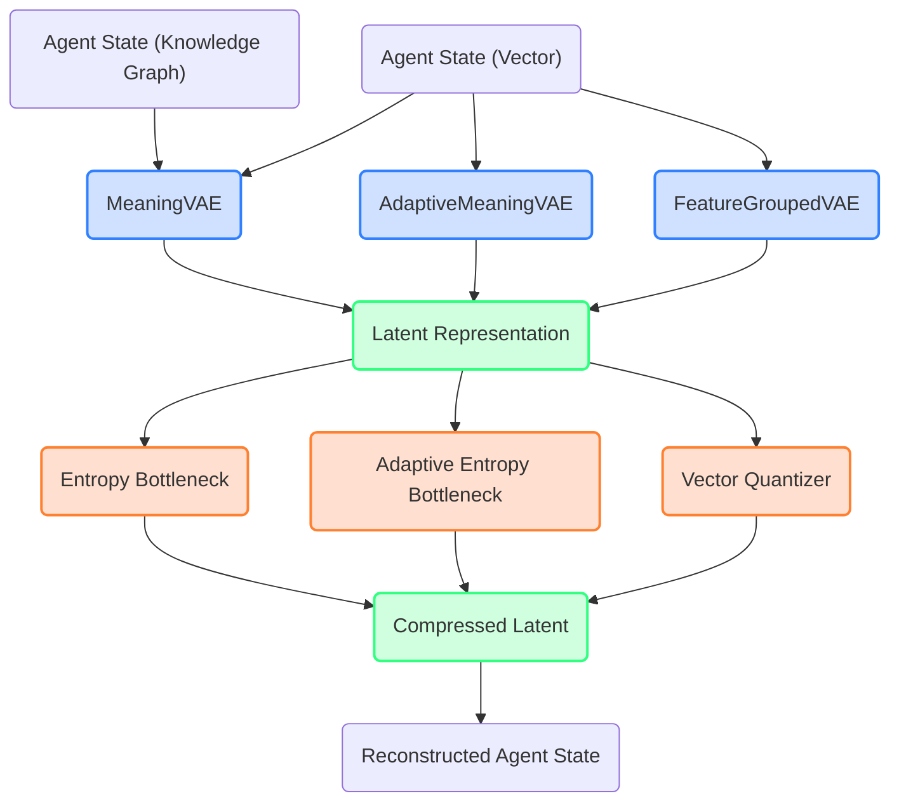

# Models Module Documentation

## Overview

The Models module forms the core neural architecture of the Meaning-Preserving Transformation System. It provides a suite of Variational Autoencoder (VAE) implementations specifically designed to transform agent states between different representations while preserving semantic meaning.

The key innovation of this module is its focus on *meaning preservation* rather than just reconstruction fidelity. By offering multiple compression strategies and adaptive architectures, it enables a balance between compression efficiency and semantic preservation that can be tailored to different domains and requirements.

## Architecture



*The Model Architecture shows the flow through the system: input agent states (vector or graph-based) are processed by different VAE models, compressed through various strategies, transformed into latent representations, and finally reconstructed.*

### Core Components

The module provides several VAE variants, each with different strengths:

| Model | Key Features | Best For |
|-------|--------------|----------|
| MeaningVAE | Multi-representation support (vector & graph), Multiple compression techniques | General purpose, flexible applications |
| AdaptiveMeaningVAE | Dynamic bottleneck structure, Parameter efficiency | Resource-constrained environments |
| FeatureGroupedVAE | Differential compression per feature group | Preserving critical features while compressing others |

### Compression Strategies

The system offers three compression approaches that can be configured based on needs:

1. **Entropy Bottleneck**: Standard information-theoretic approach to latent compression
2. **Adaptive Entropy Bottleneck**: Dynamically adjusts structure based on compression level
3. **Vector Quantization**: Discrete latent representation through codebook lookup (VQ-VAE style)

## Components in Detail

### MeaningVAE

The central model of the system, providing flexible transformation capabilities:

```python
from meaning_transform.src.models import MeaningVAE

# Vector-based VAE with entropy bottleneck
model = MeaningVAE(
    input_dim=128,              # Dimension of agent state
    latent_dim=32,              # Dimension of latent space
    compression_type="entropy", # Options: "entropy", "adaptive_entropy", "vq"
    compression_level=1.0,      # Higher values = more compression
    use_batch_norm=True,        # Whether to use batch normalization
    use_graph=False,            # Whether to use graph-based representation
    seed=42                     # Random seed for reproducibility
)

# For graph-based representation
graph_model = MeaningVAE(
    input_dim=128,
    latent_dim=32,
    use_graph=True,
    graph_hidden_dim=64,
    gnn_type="GCN",             # Options: "GCN", "GAT", "SAGE", "GIN"
    graph_num_layers=3
)
```

MeaningVAE supports both standard vector inputs and graph-structured data through PyTorch Geometric integration. When using graph inputs, it can leverage the relational information between agent properties for improved meaning preservation.

### AdaptiveMeaningVAE

A VAE that adjusts its bottleneck structure based on the compression level:

```python
from meaning_transform.src.models import AdaptiveMeaningVAE

model = AdaptiveMeaningVAE(
    input_dim=128,
    latent_dim=32,
    compression_level=2.0,      # Higher values = more compression and fewer parameters
    use_batch_norm=True,
    seed=42
)
```

This model scales its parameter count inversely with compression level, making it more efficient at high compression rates. The effective dimensionality of the bottleneck is reduced as compression increases.

### FeatureGroupedVAE

Applies different compression rates to different feature groups:

```python
from meaning_transform.src.models import FeatureGroupedVAE

# Define feature groups with (start_idx, end_idx, compression_level)
feature_groups = {
    "important": (0, 32, 0.5),      # Less compression for important features
    "moderate": (32, 64, 1.0),      # Standard compression
    "compressible": (64, 128, 2.0)  # High compression for less critical features
}

model = FeatureGroupedVAE(
    input_dim=128,
    latent_dim=32,
    feature_groups=feature_groups,
    base_compression_level=1.0,     # Global multiplier for all groups
    use_batch_norm=True,
    seed=42
)
```

This model allows for preserving semantics of high-importance features while applying stronger compression to less critical ones. The latent space is dynamically allocated to feature groups based on their importance.

## Compression Components

### Vector Quantizer

Implements Vector Quantized VAE (VQ-VAE) approach:

```python
from meaning_transform.src.models import VectorQuantizer

quantizer = VectorQuantizer(
    latent_dim=32,
    num_embeddings=512,        # Size of the codebook
    commitment_cost=0.25       # Weight for commitment loss
)
```

The Vector Quantizer creates a discrete latent representation by mapping continuous latent vectors to the nearest vector in a learned codebook. This approach can be effective for capturing discrete semantic concepts.

### Entropy Bottleneck

Information-theoretic approach to latent compression:

```python
from meaning_transform.src.models import EntropyBottleneck

bottleneck = EntropyBottleneck(
    latent_dim=32,
    compression_level=1.0      # Higher values = more compression
)
```

The Entropy Bottleneck adds controlled noise to the latent representation during training, encouraging the model to encode information efficiently. During inference, it uses deterministic rounding for consistent results.

### AdaptiveEntropyBottleneck

Advanced entropy bottleneck with dynamic structure:

```python
from meaning_transform.src.models import AdaptiveEntropyBottleneck

bottleneck = AdaptiveEntropyBottleneck(
    latent_dim=32,
    compression_level=2.0      # Higher values = more compression and fewer parameters
)
```

This component not only applies entropy-based compression but actually reduces the dimensionality of the internal representation based on the compression level, saving parameters and computation.

## Usage Examples

### Basic Training Loop

```python
import torch
from torch.optim import Adam
from meaning_transform.src.models import MeaningVAE

# Initialize model
model = MeaningVAE(input_dim=128, latent_dim=32)
optimizer = Adam(model.parameters(), lr=1e-3)

# Training loop
for epoch in range(num_epochs):
    for batch in dataloader:
        optimizer.zero_grad()
        
        # Forward pass
        results = model(batch)
        
        # Compute loss
        reconstruction_loss = torch.nn.functional.mse_loss(
            results["reconstruction"], batch
        )
        kl_loss = results["kl_loss"]
        compression_loss = results.get("compression_loss", 0)
        
        # Total loss with weighting
        total_loss = reconstruction_loss + beta * kl_loss + gamma * compression_loss
        
        # Backward pass
        total_loss.backward()
        optimizer.step()
```

### Encoding and Decoding

```python
# Encode agent state to compressed latent representation
agent_state = torch.tensor(...)  # [batch_size, input_dim]
results = model(agent_state)
z_compressed = results["z_compressed"]

# Decode back to agent state
reconstruction = model.decoder(z_compressed)
```

### Working with Graph Data

```python
from torch_geometric.data import Data, Batch
from meaning_transform.src.knowledge_graph import AgentStateToGraph

# Initialize graph conversion utility
converter = AgentStateToGraph()

# Convert agent states to graph
agent_states = [...]  # List of agent states
graphs = [converter.convert(state) for state in agent_states]
batch = Batch.from_data_list(graphs)

# Process with graph-enabled model
model = MeaningVAE(input_dim=128, latent_dim=32, use_graph=True)
results = model(batch)
```

## Balancing Reconstruction and Meaning

The core challenge in the Meaning-Preserving Transformation System is balancing:

1. **Reconstruction accuracy** (how precisely the model can reproduce the input)
2. **Compression efficiency** (how compactly the information is stored)
3. **Semantic preservation** (whether the meaning is maintained)

These objectives often compete with each other. Higher compression typically reduces reconstruction accuracy, but the impact on semantic preservation varies based on how well the model has learned to prioritize meaningful features.

The models provide several hyperparameters to control this balance:

- **latent_dim**: Controls the capacity of the latent space
- **compression_level**: Controls the strength of compression
- **beta**: Weight for the KL divergence term (typically set during training)
- **feature_groups**: Allows different compression rates for different features

## Evaluating Meaning Preservation

While reconstruction error provides a basic measure of model performance, evaluating meaning preservation requires additional metrics:

1. **Downstream task performance**: How well agent behaviors are preserved after reconstruction
2. **Semantic drift metrics**: Specialized measures of how semantic relationships change
3. **Human evaluation**: Assessment by domain experts of whether the essence is preserved

The models in this module are designed to be evaluated on these meaning-centric metrics rather than just reconstruction fidelity.

## Advanced Topics

### Fine-tuning for Domain-Specific Meaning

The models can be fine-tuned to preserve domain-specific meanings by:

1. Using a custom loss function that emphasizes important semantic relationships
2. Pre-training on general data then fine-tuning on domain-specific data
3. Leveraging the FeatureGroupedVAE to prioritize semantically critical features

### Integration with Knowledge Graphs

The graph capabilities of MeaningVAE enable integration with explicit knowledge representations:

1. Agent states can be converted to knowledge graphs using the AgentStateToGraph utility
2. The model can directly process these graph structures to leverage relational information
3. This approach can be particularly effective for capturing complex semantic relationships

## Implementation Details

All models inherit from PyTorch's nn.Module and implement:

- `forward()`: Main computation flow
- `encode()`: Convert input to latent representation
- `decode()`: Convert latent representation to output
- `save()` and `load()`: Persistence utilities

The compression components implement a consistent interface for interoperability.

## Contributing

When extending the models module, follow these guidelines:

1. Maintain the consistent interface for interoperability
2. Add appropriate tests for new functionality
3. Document hyperparameters and their effects
4. Consider the impact on meaning preservation when making architectural changes
