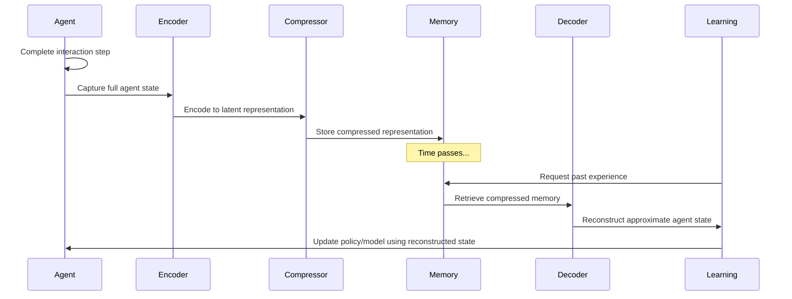

# AgentMemory Perspective in the Meaning-Preserving Transformation System

This document explains how the meaning-preserving transformation system can be utilized as a memory mechanism for intelligent agents.

## Overview

The meaning-preserving transformation system provides an effective mechanism for agent memory, enabling efficient storage of experiences while maintaining their semantic meaning. By compressing agent states for storage and later reconstructing them when needed, this system creates a memory framework that balances efficiency with meaning preservation.

## Agent Memory Flow Diagram

## Memory Process Flow

### During Experience Acquisition
1. **End of Agent Step**: 
   - The agent completes an interaction/step
   - Its full state is captured (agent attributes, relationships, etc.)

2. **Compression for Memory**:
   - The full agent state is encoded into a latent representation
   - This representation is compressed using one of the bottleneck methods
   - Only this compact representation is stored in memory
   - This significantly reduces memory requirements for long-term storage

### During Memory Recall
1. **Memory Retrieval**:
   - When needed (for training, replay, planning), the compressed memory is retrieved

2. **Reconstruction**:
   - The compressed latent vector is passed to the decoder
   - The decoder reconstructs an approximation of the original agent state
   - This reconstructed state contains the semantically important information, though some details may be lossy

3. **Usage in Learning**:
   - The reconstructed state can be used for:
     - Experience replay in reinforcement learning
     - Memory-based reasoning
     - Counterfactual simulation
     - Online training

## Key Advantages for Agent Systems

This approach offers several benefits specifically for agent systems:

1. **Meaningful Compression**: 
   - The system prioritizes preserving semantically important information
   - Less important details can be compressed more aggressively

2. **Adaptive Memory Prioritization**:
   - With FeatureGroupedVAE, the system can preserve critical features (like rewards, key relationships) with minimal loss
   - Less important features can be stored more efficiently

3. **Scalable Memory**:
   - Agents can maintain much larger memory histories within the same storage constraints
   - Compression rates can be adjusted based on memory importance or storage requirements

## Implementation Considerations

When implementing this memory system for agents:

1. **Feature Importance Analysis**:
   - Identify which agent state features are most critical for learning
   - Configure feature groups with appropriate compression levels

2. **Memory Budget Management**:
   - Adjust compression rates based on available storage
   - Consider dynamic compression that adapts based on memory significance

3. **Reconstruction Quality Metrics**:
   - Monitor semantic drift in reconstructed memories
   - Evaluate how reconstruction quality affects learning performance

4. **Integration with Learning Algorithms**:
   - Ensure learning algorithms can effectively utilize the reconstructed states
   - Consider how reconstruction uncertainty might influence learning robustness

---

This agent memory framework leverages the meaning-preserving transformation system to create efficient, semantically-rich memory systems for intelligent agents, enabling them to better learn from and utilize past experiences. 