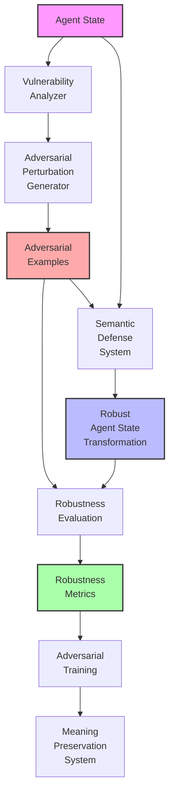
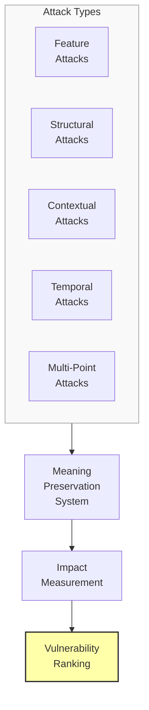
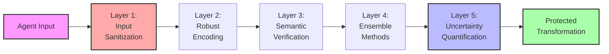

# Adversarial Meaning Robustness: A Research Proposal

## Problem Statement
Current meaning preservation systems are typically evaluated under idealized conditions with well-formed inputs. However, in real-world applications, these systems will face noisy, corrupted, or even adversarially manipulated agent states. Without explicit robustness to semantic attacks and perturbations, meaning preservation systems may catastrophically fail when faced with edge cases or deliberately crafted inputs. We propose developing an adversarial meaning robustness framework that systematically identifies semantic vulnerabilities, creates defenses against meaning distortion, and ensures reliable preservation even under challenging conditions.

## Proposed Approach

### 1. Semantic Vulnerability Assessment
Develop methods to:

- **Identify Semantic Attack Surfaces**: Discover where meaning preservation is most vulnerable
- **Generate Adversarial Perturbations**: Create minimal changes that maximally disrupt meaning
- **Categorize Vulnerability Types**: Classify different ways meaning can be compromised
- **Quantify Robustness Boundaries**: Map the limits of preservation reliability

### 2. Adversarial Defense Mechanisms
Implement techniques that:
- Detect and mitigate adversarial inputs before processing
- Strengthen preservation against different classes of semantic attacks
- Adapt dynamically to new or unforeseen perturbation types
- Maintain meaningful representation under noise and corruption

### 3. Robustness-Aware Training
Create training frameworks that:
- Incorporate adversarial examples into the learning process
- Optimize for semantic stability rather than just reconstruction accuracy
- Balance standard performance with robustness considerations
- Progressively challenge the system with increasingly sophisticated attacks

## Detailed System Specifications

Each component of the adversarial meaning robustness framework is designed to identify, address, and prevent vulnerabilities in semantic preservation. Here we provide detailed specifications for each component.

### Semantic Vulnerability Analyzer

**Purpose:** Systematically identify weak points in meaning preservation systems where semantics are vulnerable to perturbation or attack.

**Implementation Details:**
- **Architecture:** Multi-strategy vulnerability assessment framework
- **Analysis Methods:**
  - Gradient-based semantic attack surface mapping
  - Evolutionary search for minimal semantic disruptions
  - Boundary testing through systematic feature perturbation
  - Contextual sensitivity analysis for relational vulnerabilities
  - Critical feature identification through ablation studies
- **Attack Categories:**
  - Feature-level attacks (modifying individual attributes)
  - Structural attacks (altering relationships between elements)
  - Contextual attacks (changing reference frames or situations)
  - Temporal attacks (manipulating sequence or ordering)
  - Combined attacks (coordinated multi-point perturbations)
- **Key Components:**
  - Semantic difference quantification system
  - Perturbation generation and optimization
  - Vulnerability scoring and prioritization
  - Attack surface visualization

**Expected Capabilities:** Comprehensive identification of where and how meaning preservation systems are vulnerable, providing a detailed map of semantic weaknesses to address through defensive measures.

### Adversarial Perturbation Generator

**Purpose:** Create effective test cases that challenge meaning preservation systems through minimal but semantically significant changes.

**Implementation Details:**
- **Architecture:** Multi-objective adversarial example generator with semantic constraints
- **Generation Strategies:**
  - Gradient-based optimization targeting semantic vulnerabilities
  - Genetic algorithms for evolving effective perturbations
  - GAN-based approach for generating realistic adversarial examples
  - Semantic boundary exploration through interpolation
  - Rule-based generation for semantically meaningful edge cases
- **Optimization Objectives:**
  - Maximize semantic distortion
  - Minimize perturbation magnitude
  - Maintain physical plausibility
  - Ensure detectability by humans while challenging machines
- **Key Components:**
  - White-box attack generators using system gradients
  - Black-box attack generators using query-based approaches
  - Transferability testing across transformation approaches
  - Progressive difficulty scaling for perturbations

**Expected Capabilities:** Generation of diverse, effective adversarial examples that specifically target semantic vulnerabilities, creating a comprehensive test suite for evaluating and improving robustness.

### Semantic Defense System

**Purpose:** Protect meaning preservation systems from adversarial attacks and enhance robustness to perturbations.

**Implementation Details:**
- **Architecture:** Multi-layer defense framework with detection and mitigation strategies
- **Defense Layers:**
  - Input Sanitization: Preprocessing to detect and clean adversarial inputs
  - Robust Encoding: Transformation techniques resistant to perturbations
  - Semantic Verification: Consistency checking during processing
  - Ensemble Approaches: Multiple complementary preservation methods
  - Uncertainty Quantification: Confidence estimation for transformations
- **Defense Mechanisms:**
  - Adversarial training with generated examples
  - Semantic smoothing across feature space
  - Relational consistency enforcement
  - Contextual awareness for anomaly detection
  - Transformation path diversity
- **Key Components:**
  - Adversarial example detectors
  - Robust transformation operators
  - Semantic consistency verifiers
  - Confidence estimation system
  - Recovery mechanisms for detected attacks

**Expected Capabilities:** Significantly enhanced robustness to various types of semantic perturbations, maintaining meaning preservation performance even when faced with adversarial inputs or corrupted agent states.

### Robustness Evaluation Framework

**Purpose:** Systematically measure and benchmark the resilience of meaning preservation systems to different types of semantic challenges.

**Implementation Details:**
- **Architecture:** Comprehensive multi-dimensional testing framework
- **Evaluation Dimensions:**
  - Adversarial robustness against generated attacks
  - Noise tolerance at different intensities and types
  - Corruption resistance across various distortion types
  - Out-of-distribution handling capabilities
  - Graceful degradation under increasing attack strength
- **Benchmark Components:**
  - Standard adversarial test suite
  - Graduated difficulty challenge sets
  - Real-world corruption scenarios
  - Targeted attack collections for specific vulnerabilities
  - Comparative baseline measurements
- **Key Components:**
  - Automated evaluation pipeline
  - Robustness score calculation
  - Vulnerability mapping visualization
  - Comparative analysis tools
  - Progress tracking across system iterations

**Expected Capabilities:** Rigorous, reproducible assessment of semantic robustness across multiple dimensions, providing clear metrics for improvement and comparison between different preservation approaches.

### Integration with Existing System

The adversarial meaning robustness framework integrates with the meaning preservation system through:

**Integration Points:**
1. **Adversarial Training Pipeline**: Feeding generated examples into the training process
2. **Robustness-Enhanced Loss Functions**: Adding terms that promote semantic stability
3. **Defense Preprocessing Layer**: Filtering and sanitizing inputs before transformation
4. **Ensemble Transformation Approaches**: Combining multiple methods for greater robustness

**Data Flow:**
- Vulnerability analyzer identifies semantic weak points
- Perturbation generator creates challenging test cases
- Defense system implements protective measures
- Robustness evaluation provides feedback on effectiveness
- Training system incorporates adversarial examples

## Visual Representations

### Diagram 1: Adversarial Meaning Robustness Framework

### Diagram 2: Semantic Attack Types

### Diagram 3: Defense Mechanism Layers

## Implementation Plan

1. **Phase 1**: Semantic vulnerability analysis
   - Develop gradient-based vulnerability mapping tools
   - Implement evolutionary search for semantic weak points
   - Create visualization system for attack surfaces
   - Build sensitivity analysis framework
   - Develop vulnerability classification system

2. **Phase 2**: Adversarial perturbation generation
   - Implement white-box adversarial example generators
   - Develop black-box attack strategies
   - Create semantic GAN for realistic adversarial examples
   - Build test suite with graduated difficulty levels
   - Develop transferability testing framework

3. **Phase 3**: Semantic defense mechanisms
   - Implement input sanitization preprocessing
   - Develop robust encoding techniques
   - Create semantic verification systems
   - Build ensemble transformation approaches
   - Implement uncertainty quantification

4. **Phase 4**: Robustness-aware training and evaluation
   - Develop adversarial training pipeline
   - Create robustness-enhanced loss functions
   - Build comprehensive evaluation framework
   - Implement comparative analysis tools
   - Develop progress tracking and visualization

## Expected Outcomes

1. **Enhanced Robustness**: Meaning preservation systems that maintain performance under adversarial conditions

2. **Semantic Security**: Better understanding and mitigation of vulnerabilities in preservation approaches

3. **Reliability Guarantees**: Clearer boundaries and confidence levels for semantic transformation

4. **Graceful Degradation**: Systems that fail safely rather than catastrophically when pushed beyond limits

5. **Quantifiable Benefits**:
   - 80%+ reduction in successful semantic attacks
   - Maintenance of at least 90% performance under perturbation
   - Significant improvement in out-of-distribution handling
   - Clear reliability guarantees with quantified confidence levels

## Evaluation Framework

The effectiveness of the adversarial meaning robustness framework will be measured through:

1. **Attack Success Rate Metrics**:
   - Percentage of adversarial examples that disrupt meaning
   - Average semantic distortion under different attack types
   - Success rate comparison across defense mechanisms
   - Minimum perturbation required for successful attacks

2. **Defense Effectiveness Metrics**:
   - Detection rate for adversarial inputs
   - False positive rates for legitimate inputs
   - Semantic preservation under known attack patterns
   - Generalization to novel attack types

3. **Robustness Comparison**:
   - Performance degradation curves under increasing attack strength
   - Relative robustness compared to baseline systems
   - Cross-system transferability of attacks
   - Efficiency of different defense mechanisms

4. **Integration Impact**:
   - Computational overhead of defensive measures
   - Trade-offs between standard performance and robustness
   - Training efficiency with adversarial examples
   - Generalization improvements from robust training

This proposal outlines a comprehensive approach to enhancing the robustness of meaning preservation systems against adversarial attacks and perturbations. By implementing this framework, we can significantly improve the reliability and trustworthiness of semantic transformations in real-world, challenging conditions. 