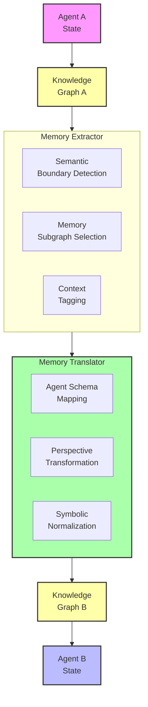
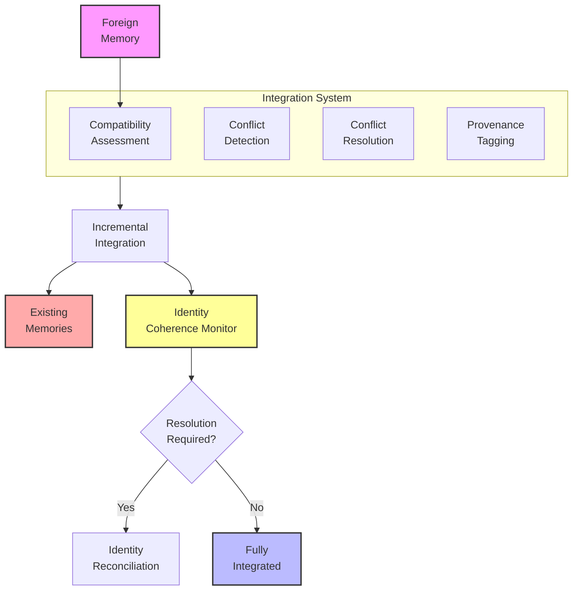
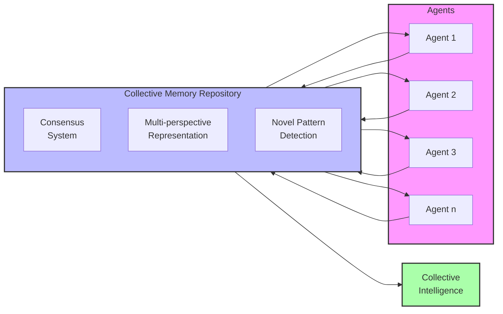

# Agent Memory Sharing: A Research Proposal

## Problem Statement
Current agent systems operate with isolated memory structures, limiting collaborative intelligence and knowledge transfer. While our meaning-preserving transformation system effectively encodes individual agent states, it lacks mechanisms for meaningful memory exchange between agents. This isolation prevents the emergence of collective intelligence, shared learning, and multi-perspective knowledge representation. We propose developing a comprehensive framework for agent memory sharing that preserves semantic integrity during transfer, enables meaningful integration of foreign memories, and supports the development of shared experiential knowledge.

## Proposed Approach

### 1. Memory Extraction and Translation
Develop techniques to:
- Extract semantically coherent memory subgraphs from an agent's knowledge representation
- Translate memory representations across different agent architectures
- Preserve subjective context while enabling objective content transfer
- Ensure semantic fidelity during cross-agent transmission

### 2. Semantic Integration Mechanisms
Create systems that:
- Incorporate foreign memories while maintaining agent identity cohesion
- Resolve semantic conflicts between existing and incoming memories
- Tag and track provenance of shared memories
- Enable selective memory sharing with privacy boundaries

### 3. Collective Memory Emergence
Implement frameworks for:
- Building shared memory repositories across agent populations
- Developing consensus representations from multiple subjective memories
- Enabling multi-perspective enrichment of semantic representations
- Measuring collective intelligence emergence from memory sharing

## Detailed System Specifications

Each component of the memory sharing framework addresses specific challenges in cross-agent knowledge transfer. Here we provide detailed specifications for each component.

### Memory Extraction and Translation System

**Purpose:** Enable the selection, extraction, and translation of memory subgraphs between different agent architectures.

**Implementation Details:**
- **Architecture:** Modular extractor with translation pathways for cross-agent compatibility
- **Extraction Process:**
  - Semantic boundary detection for memory chunking
  - Relational integrity preservation during extraction
  - Context tagging to maintain provenance
  - Relevance filtering for targeted memory sharing
- **Translation Mechanism:**
  - Agent-schema mapping for architectural differences
  - Symbolic representation normalization
  - Perspective transformation for subjective elements
  - Fidelity validation through semantic equivalence testing
- **Key Components:**
  - Memory subgraph selector with coherence metrics
  - Cross-architecture translation layer
  - Semantic fidelity verification system
  - Subjective-objective separator

**Expected Capabilities:** Reliable extraction and translation of memory structures between different agent types while preserving both factual content and appropriate contextual meaning.

### Semantic Integration System

**Purpose:** Enable agents to incorporate foreign memories while maintaining identity coherence and resolving conflicts.

**Implementation Details:**
- **Architecture:** Integration framework with conflict resolution and identity preservation
- **Integration Process:**
  - Compatibility assessment with existing knowledge
  - Conflict detection and resolution strategies
  - Memory weighting based on source reliability
  - Incremental integration with rollback capability
- **Identity Preservation Mechanisms:**
  - Core belief protection boundaries
  - Perspective tagging for foreign memories
  - Identity coherence monitoring
  - Selective rejection of incompatible memories
- **Key Components:**
  - Semantic conflict detector and resolver
  - Belief system compatibility analyzer
  - Integration impact predictor
  - Identity coherence maintenance system

**Expected Capabilities:** Seamless incorporation of foreign memories with clear provenance tracking, appropriate weighting, and preservation of agent identity despite memory sharing.

### Collective Memory System

**Purpose:** Enable the emergence of shared knowledge structures and collective intelligence across agent populations.

**Implementation Details:**
- **Architecture:** Distributed memory network with consensus mechanisms
- **Collective Formation Process:**
  - Memory contribution from multiple agent sources
  - Consensus building through semantic alignment
  - Conflict resolution at population scale
  - Multi-perspective enrichment of shared concepts
- **Knowledge Emergence Mechanisms:**
  - Pattern detection across distributed memories
  - Confidence weighting through multiple observations
  - Novel insight extraction from combined perspectives
  - Collective knowledge validation protocols
- **Key Components:**
  - Distributed memory graph with contribution tracking
  - Consensus formation algorithms
  - Multi-perspective representation synthesizer
  - Collective intelligence metrics framework

**Expected Capabilities:** Formation of rich, validated collective knowledge that exceeds the capabilities of individual agents, with emergent insights and more robust semantic representations.

### Integration with Existing System

The memory sharing framework integrates with the meaning preservation system through:

**Integration Points:**
1. **Knowledge Graph Extension**: Additional relation types for shared memories
2. **Translation Layer**: Cross-agent semantic mapping modules
3. **Integration Interface**: Memory incorporation pathways
4. **Collective Repository**: Distributed memory storage and access system

**Data Flow:**
- Agent states are processed through the symbolic encoder and graph construction
- Memory subgraphs are extracted for sharing based on relevance and permissions
- Translation occurs between agent architectures
- Recipients integrate memories with conflict resolution
- Collective patterns emerge in shared memory spaces

## Visual Representations

### Diagram 1: Memory Extraction and Translation

### Diagram 2: Semantic Integration Process

### Diagram 3: Collective Memory Formation

## Implementation Plan

1. **Phase 1**: Memory extraction and boundary definition
   - Develop algorithms for coherent memory subgraph selection
   - Implement context preservation mechanisms
   - Create semantic boundary detection tools
   - Build memory provenance tracking system

2. **Phase 2**: Cross-agent translation framework
   - Implement agent schema mapping mechanisms
   - Develop perspective transformation techniques
   - Create symbolic normalization processes
   - Build fidelity validation metrics

3. **Phase 3**: Semantic integration system
   - Develop compatibility assessment frameworks
   - Implement conflict detection and resolution strategies
   - Create identity coherence monitoring tools
   - Build incremental integration with safeguards

4. **Phase 4**: Collective memory and intelligence
   - Develop distributed memory repository architecture
   - Implement consensus formation algorithms
   - Create multi-perspective synthesis mechanisms
   - Build collective intelligence emergence metrics

## Expected Outcomes

1. **Enhanced Collaborative Learning**: Agents will learn from shared experiences rather than independently rediscovering knowledge

2. **Multi-Perspective Enrichment**: Memories will contain richer representations through different agent viewpoints

3. **Semantic Robustness**: Knowledge will become more reliable through cross-validation across multiple agents

4. **Emergent Insights**: New patterns and connections will emerge that aren't visible from single-agent perspectives

5. **Quantifiable Benefits**:
   - 30-50% reduction in learning time through shared experiences
   - 40% more robust semantic representations through multi-perspective enrichment
   - 25% increase in novel insight generation through collective memory patterns
   - Preservation of 90%+ semantic fidelity during memory transfers 