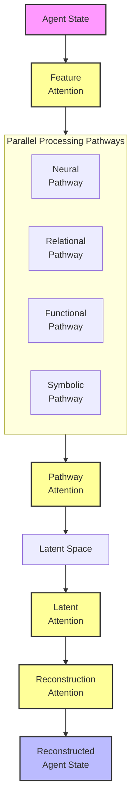
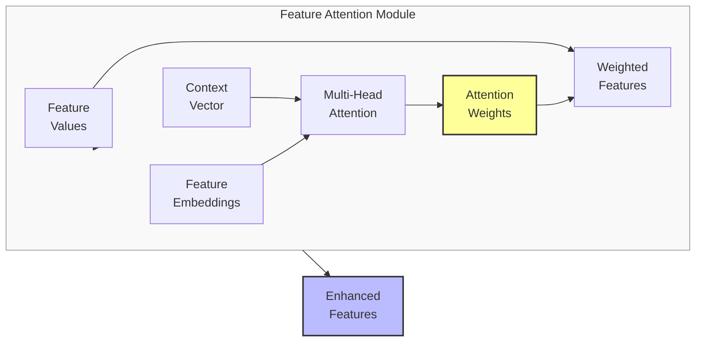
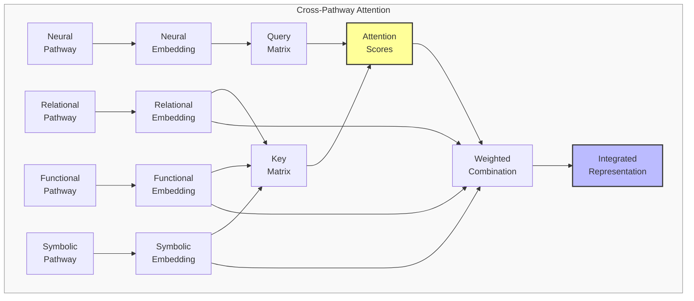

# Attention Mechanisms for Meaning Preservation: A Research Proposal

## Problem Statement
Current meaning preservation approaches in our transformation system treat all features with relatively fixed importance weights. However, meaning is contextual and dynamic—different aspects of an agent state become more or less relevant depending on the situation, task, and reconstruction goals. We propose developing and experimenting with specialized attention mechanisms that can dynamically focus on the most semantically relevant information across different transformational contexts.

## Proposed Approach

### 1. Multi-Level Attention Architecture
Implement attention mechanisms at strategic points in the meaning-preservation pipeline:

- **Feature-Level Attention**: Dynamically weight input features based on semantic importance
- **Pathway-Level Attention**: Coordinate information flow between neural, relational, functional, and symbolic pathways
- **Latent-Level Attention**: Process latent representations to emphasize meaningful patterns
- **Reconstruction-Level Attention**: Guide the decoding process with targeted focus on meaning-critical elements

## Detailed Attention Mechanism Specifications

Each attention mechanism in our system is designed to enhance a different aspect of meaning preservation. Here we provide detailed specifications for each attention type and their integration points.

### Feature-Level Attention

**Purpose:** Dynamically identify and emphasize the most semantically relevant features in agent states before encoding.

**Implementation Details:**
- **Architecture:** Multi-head self-attention module processing normalized feature vectors
- **Input Processing:** Features embedded with positional and type encodings
- **Attention Process:**
  - Query/Key/Value transformations of feature embeddings
  - Scaled dot-product attention with feature-type-aware masking
  - Multi-head parallel attention with different projection spaces
- **Weighting Mechanism:** Softmax-normalized attention scores multiply feature values
- **Key Components:**
  - Learned feature type embeddings (continuous, categorical, relational)
  - Context-sensitive importance scoring
  - Residual connections to maintain all information with selective emphasis

**Expected Benefits:** Adaptive prioritization of features based on contextual importance rather than static weights, improved relevance detection across different scenarios.

### Pathway-Level Attention

**Purpose:** Coordinate information flow between the different processing pathways to create coherent, integrated representations.

**Implementation Details:**
- **Architecture:** Cross-pathway attention with learned projection matrices
- **Input Processing:** Pathway outputs embedded into a common representational space
- **Attention Process:**
  - Each pathway generates queries that attend to keys/values from all pathways
  - Attention weights determine information mixing across pathways
  - Gating mechanism controls information flow based on pathway confidence
- **Fusion Mechanism:** Weighted combination of pathway outputs with dynamically learned weights
- **Key Components:**
  - Pathway compatibility assessment module
  - Task-specific attention bias vectors
  - Uncertainty-weighted fusion

**Expected Benefits:** Better integration of different aspects of meaning, improved handling of cases where pathways disagree, and context-appropriate emphasis of different meaning dimensions.

### Latent-Level Attention

**Purpose:** Process compressed latent representations to emphasize meaningful patterns and relationships.

**Implementation Details:**
- **Architecture:** Self-attention layers operating within the latent space
- **Input Processing:** Latent vectors reshaped into sequences or graphs for attention processing
- **Attention Process:**
  - Intra-latent attention to capture dependencies between latent dimensions
  - Temporal attention for sequence data to capture semantic evolution
  - Graph attention for relationship data to preserve structural meaning
- **Representation Enhancement:** Attention-processed latent vectors with emphasized semantic structure
- **Key Components:**
  - Semantic similarity guidance in attention scoring
  - Contrastive attention mechanisms
  - Sparse attention to maintain compression efficiency

**Expected Benefits:** Enhanced semantic structure in latent space, better preservation of long-range dependencies, and improved handling of complex semantic patterns.

### Reconstruction-Level Attention

**Purpose:** Guide the decoding process with targeted focus on meaning-critical elements during reconstruction.

**Implementation Details:**
- **Architecture:** Decoder with cross-attention to original input features
- **Input Processing:** Latent vectors as queries, original features as keys/values
- **Attention Process:**
  - Decoder generates queries from latent representation
  - Keys and values derived from original input features
  - Progressive attention refinement through decoder layers
- **Reconstruction Guidance:** Attention-weighted feature reconstruction prioritizing meaning-critical elements
- **Key Components:**
  - Feature importance memory mechanism
  - Adaptive attention temperature based on reconstruction difficulty
  - Error-driven attention modulation

**Expected Benefits:** More accurate reconstruction of semantically critical features, better handling of ambiguous cases, and improved recovery of meaning-defining details.

### Integration and Training Strategy

The attention mechanisms work together as an integrated system with these key connections:

**Integration Approach:**
1. **Cascading Attention Flow:** Information and attention patterns flow from feature level through to reconstruction
2. **Shared Semantic Context:** A global context vector influences all attention mechanisms
3. **Attention Consistency Regulation:** Penalties for contradictory attention patterns across levels
4. **Feedback Loops:** Reconstruction accuracy influences feature attention in subsequent passes

**Training Strategy:**
- Two-phase training with initial supervised attention based on feature importance metrics
- Progressive transition to learned attention patterns
- Adversarial attention perturbation to improve robustness
- Meta-learning approach to adapt attention mechanisms to different domains

### 2. Attention Mechanism Variants
Explore and compare different attention architectures:

- **Scaled Dot-Product Attention**: Fast, parallelizable attention for feature weighting
- **Graph Attention Networks (GAT)**: To preserve relational structures in knowledge graphs
- **Sparse Transformers**: For efficient processing of high-dimensional agent states
- **Adaptive Sparse Attention**: Dynamic sparsity patterns based on semantic relevance

### 3. Context-Sensitive Attention
Develop mechanisms that adjust attention based on:

- **Task Context**: Different attention patterns for different downstream tasks
- **Agent Role**: Specialized attention for different agent types or roles
- **Reconstruction Goals**: Attention that prioritizes differently based on what's being preserved
- **Semantic Drift Indicators**: Attention that responds to detected meaning loss

## Visual Representations

### Diagram 1: Multi-Level Attention Architecture

### Diagram 2: Feature-Level Attention Detail

### Diagram 3: Cross-Pathway Attention

## Implementation Plan

1. **Phase 1**: Develop and benchmark individual attention mechanisms
   - Implement feature-level attention and measure impact on encoding quality
   - Develop pathway-level attention for cross-pathway integration
   - Create latent-level attention for semantic structure enhancement
   - Build reconstruction-level attention for guided decoding

2. **Phase 2**: Integration and comparative analysis
   - Combine attention mechanisms into a unified architecture
   - Compare against non-attention baselines across preservation metrics
   - Measure impact on different aspects of meaning preservation
   - Identify optimal combinations for various agent types and scenarios

3. **Phase 3**: Context-sensitive adaptation
   - Develop task-specific attention adaptation mechanisms
   - Create meta-learning framework for automatic attention tuning
   - Implement drift-responsive attention that reacts to meaning loss
   - Build visualization tools for attention pattern analysis

4. **Phase 4**: Ablation studies and robustness testing
   - Systematically test impact of each attention component
   - Evaluate robustness to perturbations and distribution shifts
   - Measure computational efficiency and optimize attention bottlenecks
   - Develop guidelines for when to use which attention mechanisms

## Expected Outcomes

1. **Enhanced Meaning Preservation**: More accurate reconstruction of semantically critical features, particularly in complex agent states
  
2. **Improved Adaptability**: System that can dynamically adjust what aspects of meaning it preserves based on context

3. **Better Integration**: More coherent fusion of different meaning dimensions through coordinated attention

4. **Explainability**: Attention patterns that provide insight into what aspects of meaning the system considers important in different contexts

5. **Quantifiable Benefits**: Measurable improvements in:
   - Semantic drift reduction at higher compression ratios
   - Behavioral equivalence between original and reconstructed states
   - Relational structure preservation in complex scenarios
   - Task performance on downstream agent state processing tasks

## Evaluation Framework

The effectiveness of attention mechanisms will be measured through:

1. **Meaning Preservation Metrics**:
   - Semantic similarity between original and reconstructed states
   - Behavioral equivalence in decision-making scenarios
   - Relational structure preservation in graph-based tests
   - Symbolic consistency verification for rule preservation

2. **Attention Quality Metrics**:
   - Attention entropy (measuring focus vs. diffusion)
   - Attention stability across similar inputs
   - Correlation between attention and feature importance
   - Task-specific attention alignment

3. **Compression Efficiency**:
   - Meaning preservation vs. compression rate curves
   - Computational overhead of attention mechanisms
   - Memory requirements for attention-enhanced models

4. **Comparative Analysis**:
   - Against static weighting schemes
   - Against non-attention baselines
   - Against different attention mechanism variants

This proposal outlines a systematic approach to developing, implementing, and evaluating attention mechanisms for meaning preservation. By enabling the system to dynamically focus on what matters semantically in different contexts, we can significantly enhance its ability to preserve meaning across transformational boundaries. 