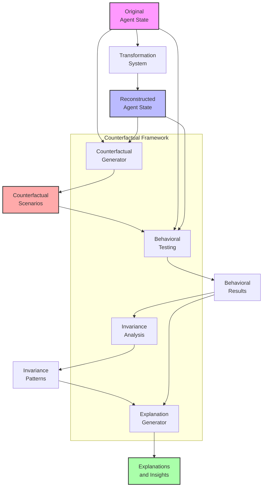
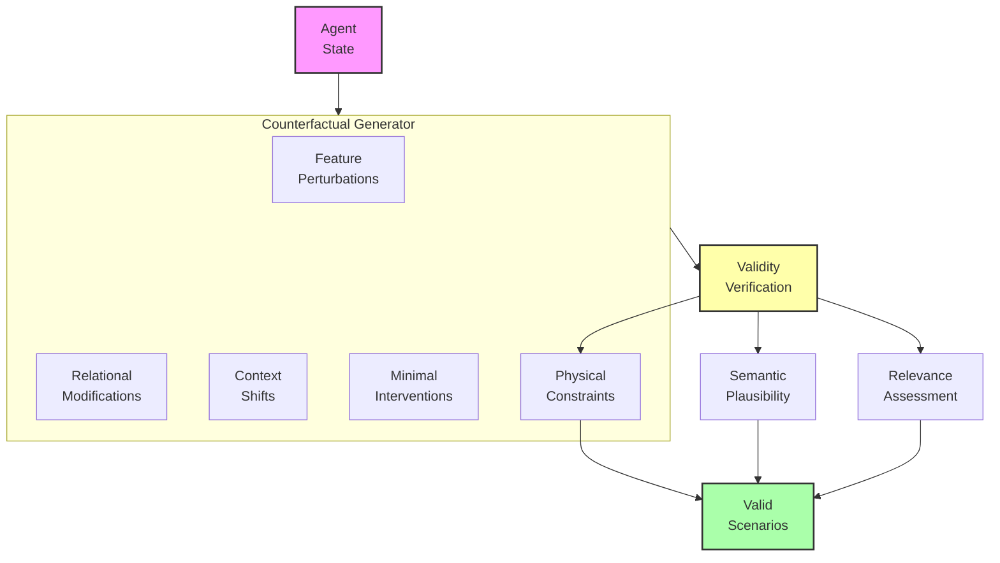
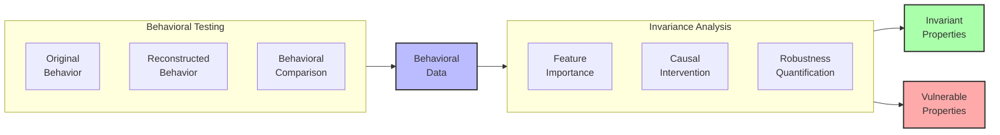

# Counterfactual Meaning Testing: A Research Proposal

## Problem Statement
Current approaches to evaluating meaning preservation rely primarily on static metrics that compare original and reconstructed agent states directly. However, these methods fail to capture the dynamic, functional aspects of meaning—how an agent would respond to different scenarios or how small perturbations might affect semantically important behaviors. Without probing how meaning holds up under counterfactual conditions, we lack a robust understanding of whether our preservation systems maintain the functional essence of agent states. We propose developing a counterfactual meaning testing framework that evaluates semantic preservation through systematic "what-if" exploration and behavioral invariance analysis.

## Proposed Approach

### 1. Counterfactual Scenario Generation
Develop systematic methods to:

- **Generate Meaningful Perturbations**: Create semantically relevant variations of agent states
- **Design Decision-Critical Scenarios**: Construct situations that test behavioral implications
- **Identify Semantic Boundaries**: Find the thresholds where meaning changes
- **Create Progressive Challenge Levels**: Build scenarios of increasing semantic complexity

### 2. Behavioral Invariance Testing
Implement frameworks to:
- Compare agent behaviors across original and reconstructed states in counterfactual scenarios
- Identify which aspects of behavior remain invariant under transformations
- Measure the sensitivity of semantic properties to different types of perturbations
- Quantify the robustness of meaning preservation in dynamic contexts

### 3. Counterfactual Explanation Generation
Create systems that:
- Explain why particular counterfactuals reveal semantic differences
- Identify which transformations preserve behavioral equivalence under counterfactuals
- Provide insights into the causal structure of meaning in agent states
- Generate diagnostic feedback for improving preservation systems

## Detailed System Specifications

Each component of the counterfactual meaning testing framework is designed to probe different aspects of semantic preservation under dynamic conditions. Here we provide detailed specifications for each component.

### Counterfactual Generator

**Purpose:** Create meaningful variations and alternative scenarios to test the functional aspects of semantic preservation.

**Implementation Details:**
- **Architecture:** Multi-strategy generation system with validity verification
- **Generation Strategies:**
  - Feature-level perturbations with controlled magnitude
  - Relational modifications that alter agent-environment dynamics
  - Context-shifting transformations that change situational factors
  - Minimal interventions that test semantic boundaries
  - Progressive challenge generation with increasing complexity
- **Validity Assurance:**
  - Semantic plausibility verification
  - Physical constraint checking
  - Relevance assessment for testing objectives
  - Diversity enforcement across generated scenarios
- **Key Components:**
  - Parameterized scenario templates for structured generation
  - Semantic distance controls for perturbation magnitude
  - Agent-specific counterfactual adaptation
  - Adversarial scenario identification

**Expected Capabilities:** Generation of diverse, semantically meaningful counterfactual scenarios that effectively probe different aspects of meaning preservation, revealing how well transformation systems maintain functional semantics.

### Behavioral Testing Engine

**Purpose:** Compare agent behaviors between original and reconstructed states across counterfactual scenarios to assess functional meaning preservation.

**Implementation Details:**
- **Architecture:** Simulation-based behavioral comparison framework with multi-metric evaluation
- **Testing Process:**
  - Parallel simulation of original and reconstructed agents
  - Application of identical counterfactual conditions
  - Behavioral response recording and comparison
  - Statistical analysis of behavioral differences
- **Comparison Dimensions:**
  - Action selection agreement
  - Goal pursuit consistency
  - Decision boundary preservation
  - Temporal response patterns
  - Value-aligned behavior
- **Key Components:**
  - Lightweight simulation environments for efficient testing
  - Behavioral vector extraction and comparison
  - Agreement quantification across action space
  - Significance testing for behavioral differences

**Expected Capabilities:** Precise measurement of behavioral consistency between original and reconstructed agent states under diverse counterfactual conditions, providing functional validation of meaning preservation.

### Invariance Analysis System

**Purpose:** Identify and characterize what aspects of meaning remain invariant across transformations and counterfactual conditions.

**Implementation Details:**
- **Architecture:** Multi-level invariance detection system with causal structure learning
- **Analysis Methods:**
  - Systematic feature importance analysis across counterfactuals
  - Causal intervention testing to isolate invariant properties
  - Robustness quantification for semantic elements
  - Stability mapping across transformation types
- **Invariance Categories:**
  - Absolute invariants (preserved across all conditions)
  - Conditional invariants (preserved under specific circumstances)
  - Statistical invariants (preserved in distribution but not individual cases)
  - Functional invariants (preserved in outcome but not mechanism)
- **Key Components:**
  - Causal discovery algorithms for semantic structure
  - Invariance scoring and ranking system
  - Sensitivity analysis for different perturbation types
  - Visualization tools for invariance mapping

**Expected Capabilities:** Comprehensive understanding of which semantic elements remain stable under transformation and which are vulnerable, providing deeper insights into the nature of preserved meaning.

### Explanation Generator

**Purpose:** Produce interpretable explanations of counterfactual testing results to guide improvement of meaning preservation systems.

**Implementation Details:**
- **Architecture:** Multi-modal explanation framework with causal reasoning
- **Explanation Types:**
  - Contrastive explanations ("X differs because of Y")
  - Counterfactual explanations ("If X had been preserved, Y would be consistent")
  - Feature attribution explanations ("X contributes most to semantic drift")
  - Threshold explanations ("Meaning breaks down when X exceeds Y")
- **Generation Methods:**
  - Case-based comparison with minimal differences
  - Decision tree extraction from behavioral patterns
  - Feature importance visualization
  - Natural language explanation synthesis
- **Key Components:**
  - Semantic difference detection algorithms
  - Causal attribution system
  - Explanation template library
  - Interactive explanation exploration interface

**Expected Capabilities:** Clear, actionable insights into why and how semantic preservation succeeds or fails under counterfactual conditions, enabling targeted improvements to transformation systems.

### Integration with Existing System

The counterfactual meaning testing framework integrates with the meaning preservation system through:

**Integration Points:**
1. **Evaluation Pipeline**: Plugs into existing evaluation workflows as an advanced testing stage
2. **Feedback Loop**: Results feed back to loss functions and model training
3. **Scenario Library**: Maintains growing database of effective counterfactual tests
4. **Preservation Metrics**: Provides additional behavioral invariance metrics

**Data Flow:**
- Transformation system produces reconstructed agent states
- Counterfactual generator creates test scenarios
- Behavioral testing engine compares responses
- Invariance analysis identifies preservation patterns
- Explanation generator provides insights for improvement

## Visual Representations

### Diagram 1: Counterfactual Testing Framework

### Diagram 2: Counterfactual Generation Strategies

### Diagram 3: Invariance Analysis Process

## Implementation Plan

1. **Phase 1**: Counterfactual generation system
   - Develop feature perturbation strategies
   - Implement relational modification methods
   - Create context shift generators
   - Build validity verification system
   - Develop progressive challenge construction

2. **Phase 2**: Behavioral testing framework
   - Implement lightweight simulation environments
   - Develop behavioral comparison metrics
   - Create action consistency analysis tools
   - Build temporal response analysis system
   - Develop statistical significance testing

3. **Phase 3**: Invariance analysis system
   - Implement feature importance analysis across counterfactuals
   - Develop causal structure learning for semantic features
   - Create invariance categorization system
   - Build robustness quantification tools
   - Develop visualization for invariance mapping

4. **Phase 4**: Explanation and integration
   - Implement explanation generation system
   - Create feedback mechanisms to transformation system
   - Build comprehensive testing library
   - Develop interactive exploration interfaces
   - Integrate with existing evaluation metrics

## Expected Outcomes

1. **Functional Validation**: Verification that preserved meaning maintains functional equivalence under diverse conditions

2. **Semantic Robustness**: Better understanding of which aspects of meaning are robust vs. vulnerable to transformations

3. **Improved Preservation**: Enhanced transformation systems guided by counterfactual insights

4. **Causal Understanding**: Deeper knowledge of the causal structure of meaning in agent states

5. **Quantifiable Benefits**:
   - More reliable behavioral consistency (>95%) between original and reconstructed states
   - Identification of previously undetected semantic vulnerabilities
   - 30-40% improvement in semantic robustness after counterfactual-guided training
   - More accurate prioritization of which semantic features to preserve

## Evaluation Framework

The effectiveness of the counterfactual meaning testing framework will be measured through:

1. **Counterfactual Generation Quality**:
   - Diversity of generated scenarios
   - Semantic relevance to preservation testing
   - Coverage of semantic space
   - Efficiency in identifying semantic boundaries

2. **Behavioral Testing Accuracy**:
   - Correlation with human judgments of equivalence
   - Statistical significance of detected differences
   - Reproducibility of behavioral comparisons
   - Sensitivity to subtle semantic changes

3. **Invariance Analysis Value**:
   - Accuracy of invariant property identification
   - Predictive power for preservation success
   - Granularity of robustness quantification
   - Utility for guiding system improvements

4. **Explanation Quality**:
   - Interpretability of generated explanations
   - Actionability of improvement suggestions
   - Completeness of causal attribution
   - User satisfaction with explanation clarity

This proposal outlines a comprehensive approach to testing meaning preservation through counterfactual exploration. By implementing this framework, we can move beyond static comparisons to truly understand whether our transformation systems preserve the functional essence of agent states under diverse and challenging conditions. 