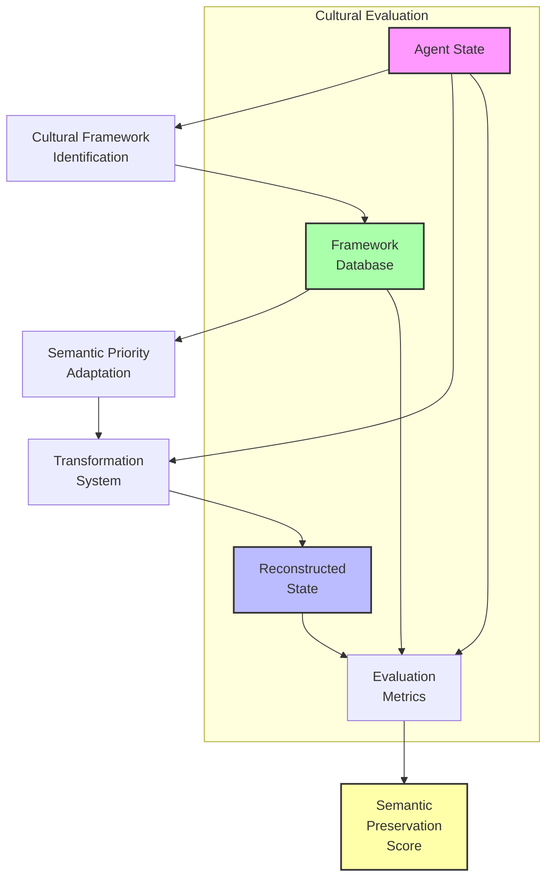
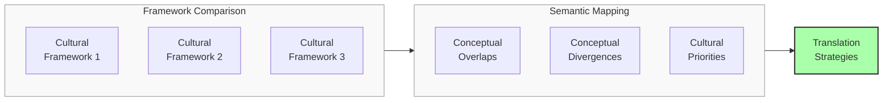
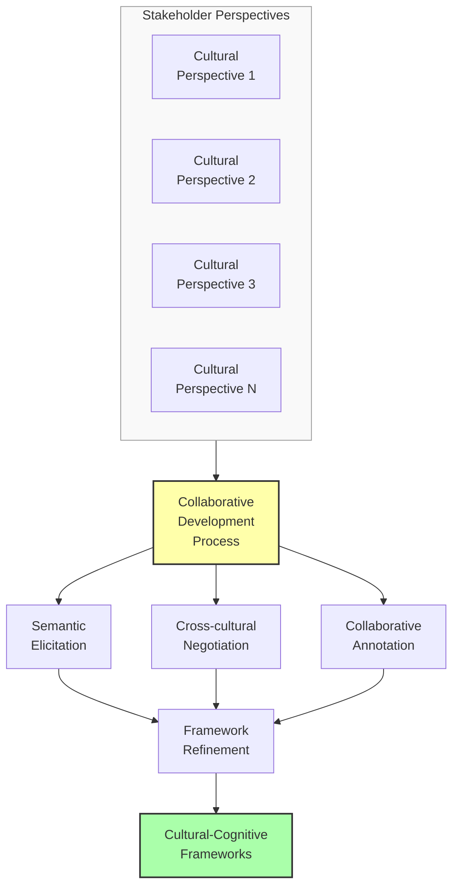

# Cross-Cultural Meaning Preservation: A Research Proposal

## Problem Statement
Current meaning preservation approaches implicitly assume a universal definition of meaning, overlooking the profound variations in how different cultural, cognitive, and disciplinary frameworks interpret and prioritize semantic content. Without accounting for these diverse perspectives, systems risk preserving aspects of meaning that are considered peripheral in some contexts while losing elements that are central. We propose developing a cross-cultural meaning preservation framework that explicitly models diverse interpretive frameworks, adapts preservation priorities to different cultural contexts, and enables meaningful translation between different semantic value systems.

## Proposed Approach

### 1. Cultural-Cognitive Semantic Mapping
Develop systems to:

- **Model Diverse Frameworks**: Represent different cultural-cognitive approaches to meaning
- **Identify Framework-Specific Priorities**: Determine what matters most in different contexts
- **Map Semantic Overlaps and Divergences**: Understand where meanings align or differ
- **Create Translation Mechanisms**: Enable preservation across interpretive boundaries

### 2. Adaptive Preservation Priorities
Implement techniques that:
- Dynamically adjust what aspects of meaning to preserve based on cultural context
- Balance universal and culture-specific semantic elements
- Adapt compression strategies to align with cultural priorities
- Provide culturally appropriate evaluation metrics

### 3. Collaborative Framework Development
Create processes for:
- Engaging diverse stakeholders in defining semantic priorities
- Building shared understanding across cultural boundaries
- Addressing potential biases in semantic assumptions
- Evolving the system as cultural-cognitive frameworks change

## Detailed System Specifications

Each component of the cross-cultural meaning preservation framework is designed to address the variability and contextuality of meaning across different interpretive frameworks. Here we provide detailed specifications for each component.

### Cultural-Cognitive Framework Modeler

**Purpose:** Create formal representations of how different cultural, cognitive, and disciplinary frameworks interpret and prioritize meaning.

**Implementation Details:**
- **Architecture:** Multi-dimensional semantic framework modeling system
- **Framework Dimensions:**
  - Cultural value systems and their semantic implications
  - Cognitive style variations (analytic vs. holistic, etc.)
  - Disciplinary knowledge structures and priorities
  - Linguistic-conceptual structures across languages
  - Contextual meaning priorities (e.g., ritual vs. practical contexts)
- **Modeling Approaches:**
  - Expert-guided knowledge engineering
  - Data-driven framework extraction from cultural corpora
  - Collaborative annotation with diverse stakeholders
  - Contrastive analysis across frameworks
  - Meta-cognitive modeling of interpretive patterns
- **Key Components:**
  - Framework representation schema
  - Cross-framework comparison tools
  - Framework visualization interface
  - Cultural-semantic ontology builder
  - Framework evolution tracking system

**Expected Capabilities:** Rich, nuanced models of how meaning is constructed and prioritized in different cultural-cognitive contexts, enabling preservation systems to adapt to diverse interpretive frameworks.

### Semantic Priority Adaptation System

**Purpose:** Dynamically adjust what aspects of meaning to preserve based on the relevant cultural-cognitive framework.

**Implementation Details:**
- **Architecture:** Context-aware priority weighting system with framework integration
- **Adaptation Mechanisms:**
  - Feature importance reweighting based on framework priorities
  - Attention mechanism redirection to culturally salient elements
  - Loss function modulation to reflect framework values
  - Representation space warping toward relevant dimensions
  - Evaluation metric adjustment for contextual assessment
- **Selection Criteria:**
  - Framework identification from contextual cues
  - Multi-framework blending for mixed contexts
  - User-specified framework preferences
  - Adaptive inference from interaction patterns
  - Default to inclusive preservation when ambiguous
- **Key Components:**
  - Framework-to-weights mapping system
  - Dynamic loss function generator
  - Attention guidance mechanisms
  - Cultural saliency detection
  - Multi-objective optimization balancing universal and specific priorities

**Expected Capabilities:** Preservation systems that appropriately prioritize different aspects of meaning based on the relevant cultural-cognitive context, resulting in transformations that feel "right" to stakeholders from different backgrounds.

### Cross-Framework Translation System

**Purpose:** Enable meaningful preservation and translation of semantic content across different cultural-cognitive frameworks.

**Implementation Details:**
- **Architecture:** Neural translation system with cultural bridging mechanisms
- **Translation Challenges:**
  - Framework-specific concepts without direct equivalents
  - Differing semantic granularity across frameworks
  - Value-laden meaning elements with cultural specificity
  - Relational structures with different prominence
  - Metaphorical frameworks with culture-specific grounding
- **Translation Strategies:**
  - Concept decomposition and recombination
  - Nearest equivalent mapping with difference annotation
  - Cultural contextualization of framework-specific elements
  - Explicit highlighting of untranslatable components
  - Meta-commentary on translation limitations
- **Key Components:**
  - Cross-framework concept alignment database
  - Translation confidence assessment
  - Cultural context preservation mechanisms
  - Untranslatability detection and handling
  - Explanation generation for translation decisions

**Expected Capabilities:** Meaningful preservation of semantic content when moving between different cultural-cognitive frameworks, with appropriate handling of both translatable and framework-specific meaning elements.

### Collaborative Framework Development Platform

**Purpose:** Engage diverse stakeholders in the ongoing definition and refinement of cultural-cognitive frameworks and their semantic priorities.

**Implementation Details:**
- **Architecture:** Multi-stakeholder collaboration platform with structured elicitation
- **Collaboration Mechanisms:**
  - Structured semantic priority elicitation
  - Cross-cultural negotiation of shared understanding
  - Collaborative annotation of example cases
  - Deliberative processes for addressing conflicts
  - Ongoing framework refinement and evolution
- **Stakeholder Engagement:**
  - Cultural domain experts and community representatives
  - Cognitive and cross-cultural psychology specialists
  - End users from diverse backgrounds
  - System designers and implementers
  - Third-party evaluators and critics
- **Key Components:**
  - Priority elicitation interfaces
  - Collaborative framework editing tools
  - Cross-cultural dialogue support
  - Consensus and disagreement visualization
  - Framework version control and evolution tracking

**Expected Capabilities:** Ongoing, inclusive development of cultural-cognitive frameworks that accurately represent diverse perspectives on meaning, avoiding inappropriate universalization or oversimplification.

### Integration with Existing System

The cross-cultural meaning preservation framework integrates with the main meaning preservation system through:

**Integration Points:**
1. **Framework-Aware Encoding**: Cultural-cognitive context influences encoding process
2. **Adaptive Loss Functions**: Preservation objectives reflect contextual priorities
3. **Translation Interfaces**: Mechanisms for preserving meaning across frameworks
4. **Culturally-Appropriate Evaluation**: Metrics that respect diverse definitions of success

**Data Flow:**
- Cultural-cognitive framework is identified or selected
- Framework-specific priorities influence encoding and compression
- Cross-framework translation applies when moving between contexts
- Evaluation considers the relevant interpretive frameworks
- Stakeholder feedback informs framework refinement

## Visual Representations

### Diagram 1: Cross-Cultural Meaning Preservation Framework

### Diagram 2: Cultural-Cognitive Framework Comparison

### Diagram 3: Collaborative Framework Development

## Implementation Plan

1. **Phase 1**: Cultural-cognitive framework modeling
   - Develop framework representation schema
   - Implement initial framework models for diverse contexts
   - Create cross-framework comparison tools
   - Build framework visualization interfaces
   - Develop cultural-semantic ontology builder

2. **Phase 2**: Semantic priority adaptation
   - Implement framework-to-weights mapping system
   - Develop dynamic loss function generator
   - Create attention guidance mechanisms
   - Build cultural saliency detection
   - Implement multi-objective optimization for balancing priorities

3. **Phase 3**: Cross-framework translation
   - Develop cross-framework concept alignment database
   - Implement translation confidence assessment
   - Create cultural context preservation mechanisms
   - Build untranslatability detection and handling
   - Develop explanation generation for translation decisions

4. **Phase 4**: Collaborative platform and integration
   - Implement priority elicitation interfaces
   - Develop collaborative framework editing tools
   - Create cross-cultural dialogue support
   - Build consensus and disagreement visualization
   - Integrate with existing meaning preservation system

## Expected Outcomes

1. **Cultural Appropriateness**: Meaning preservation systems that respect and adapt to diverse interpretive frameworks

2. **Improved Cross-Cultural Translation**: Better preservation of semantic content when moving between different contexts

3. **Reduced Cultural Bias**: Mitigation of implicit assumptions about universal meaning structures

4. **Stakeholder Inclusion**: More inclusive development process that incorporates diverse perspectives

5. **Quantifiable Benefits**:
   - Significantly higher satisfaction from diverse user groups
   - Better preservation of culturally-specific semantic elements
   - More accurate cross-framework semantic translation
   - Reduced cultural bias in semantic evaluations

## Evaluation Framework

The effectiveness of the cross-cultural meaning preservation framework will be measured through:

1. **Cultural Appropriateness Metrics**:
   - Stakeholder satisfaction across diverse groups
   - Preservation of culturally-specific semantic elements
   - Alignment with framework-specific priorities
   - Appropriateness of semantic focus in different contexts

2. **Translation Quality Metrics**:
   - Cross-framework semantic preservation accuracy
   - Appropriate handling of untranslatable elements
   - Cultural context maintenance in translation
   - Stakeholder evaluation of translation fidelity

3. **Bias Mitigation Metrics**:
   - Balanced performance across different frameworks
   - Reduction in framework-specific preservation errors
   - Appropriate handling of value-laden concepts
   - Equitable representation of diverse semantic structures

4. **Collaborative Process Metrics**:
   - Inclusivity of framework development process
   - Quality and diversity of stakeholder engagement
   - Consensus achievement on shared elements
   - Appropriate retention of legitimate differences

This proposal outlines a comprehensive approach to addressing the cultural-cognitive variability in how meaning is constructed and prioritized. By implementing this framework, we can create meaning preservation systems that appropriately adapt to diverse interpretive contexts, enabling more culturally appropriate and inclusive semantic transformation. 