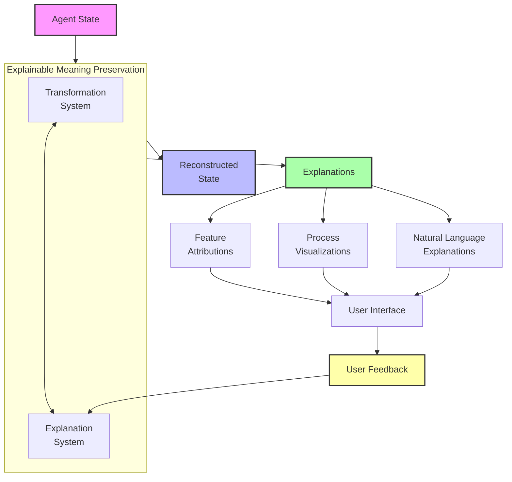
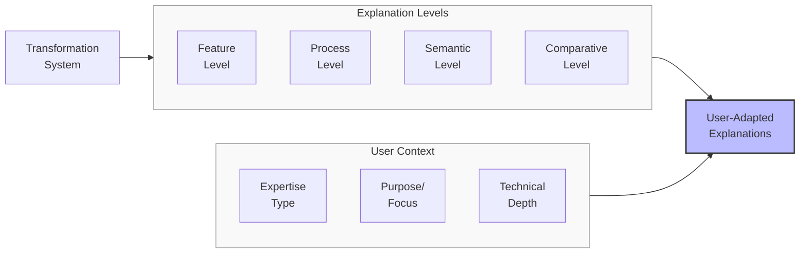
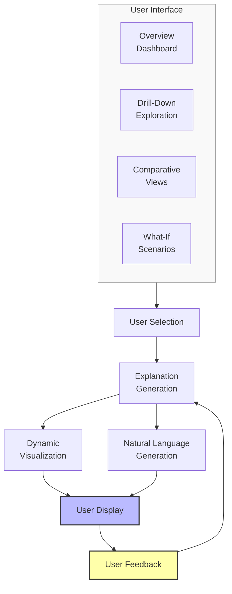

# Explainable Meaning Transformation: A Research Proposal

## Problem Statement
Current meaning preservation systems operate largely as black boxes, with limited visibility into why certain semantic elements are preserved while others are lost during transformation. This opacity hinders user trust, makes it difficult to diagnose preservation failures, and limits the ability to fine-tune systems for specific semantic priorities. Without explainability, meaning preservation remains more art than science. We propose developing an explainable meaning transformation framework that makes the encoding, compression, and reconstruction processes transparent, interpretable, and aligned with human understanding of semantic importance.

## Proposed Approach

### 1. Multi-Level Explanation Generation
Develop mechanisms to:

- **Explain Feature Importance**: Clarify which agent features most influence preservation
- **Visualize Transformation Decisions**: Show how and why elements are encoded and reconstructed
- **Articulate Semantic Rationales**: Generate natural language explanations for semantic choices
- **Highlight Preservation Trade-offs**: Make explicit the compromises in different preservation strategies

### 2. Interactive Explanation Interfaces
Implement interfaces that:
- Allow users to explore different aspects of the transformation process
- Enable "what-if" exploration of alternative preservation strategies
- Provide contextual explanations at different levels of technical detail
- Incorporate user feedback to improve explanation relevance and quality

### 3. Explanation-Aware Training
Create training frameworks that:
- Optimize for both semantic preservation and explainability simultaneously
- Generate inherently more interpretable intermediate representations
- Include explanation quality in the evaluation metrics
- Incorporate human feedback on explanation utility

## Detailed System Specifications

Each component of the explainable meaning transformation framework is designed to provide transparency and interpretability at different levels of the semantic preservation process. Here we provide detailed specifications for each component.

### Feature Attribution System

**Purpose:** Identify and communicate which features of agent states contribute most significantly to meaning preservation decisions.

**Implementation Details:**
- **Architecture:** Multi-method attribution framework with consistency reconciliation
- **Attribution Methods:**
  - Gradient-based attribution (e.g., integrated gradients, SmoothGrad)
  - Perturbation-based attribution (e.g., LIME, SHAP)
  - Attention-based attribution from internal attention mechanisms
  - Counterfactual attribution through minimal edits
  - Rule extraction for explicit decision criteria
- **Visualization Approaches:**
  - Feature importance heat maps
  - Contribution flow diagrams
  - Comparative attribution across features
  - Temporal attribution changes
  - Uncertainty visualization for attribution confidence
- **Key Components:**
  - Attribution generator for different algorithm types
  - Cross-method consistency analyzer
  - Context-sensitive attribution filtering
  - Progressive disclosure of attribution detail
  - Interactive attribution exploration interface

**Expected Capabilities:** Clear, consistent identification of which agent state features most influence preservation decisions, enabling users to understand where the system focuses and why.

### Transformation Process Visualizer

**Purpose:** Make visible the internal operations of the meaning preservation system as it encodes, compresses, and reconstructs agent states.

**Implementation Details:**
- **Architecture:** Multi-stage visualization system with interactive exploration
- **Visualization Layers:**
  - Input processing and normalization visualization
  - Encoding operations and dimensionality reduction
  - Latent space organization and structure
  - Compression process and information prioritization
  - Decoding strategy and reconstruction decisions
- **Interaction Methods:**
  - Step-by-step process walkthrough
  - Component isolation for focused examination
  - Alternative path exploration for "what-if" analysis
  - Zooming between overview and detailed views
  - Highlighting of critical transformation points
- **Key Components:**
  - Process flow visualization engine
  - Intermediate representation visualizers
  - Comparative visualization between stages
  - Anomaly highlighting for unusual transformations
  - Semantic change tracking across the pipeline

**Expected Capabilities:** Transparent visualization of how meaning moves through the transformation pipeline, revealing how encoding and decoding decisions impact semantic preservation.

### Natural Language Explanation Generator

**Purpose:** Produce clear, contextually appropriate natural language explanations of semantic preservation decisions.

**Implementation Details:**
- **Architecture:** Multi-level explanation generation system with context adaptation
- **Explanation Types:**
  - Process explanations ("How the transformation works")
  - Decision explanations ("Why this feature was preserved")
  - Comparative explanations ("Why X was prioritized over Y")
  - Counterfactual explanations ("What would change if...")
  - Uncertainty explanations ("Confidence in this preservation")
- **Adaptation Dimensions:**
  - Technical detail level (novice to expert)
  - Explanation focus (overview vs. specific details)
  - User purpose (understanding vs. debugging vs. improving)
  - Temporal scope (specific decision vs. pattern over time)
- **Key Components:**
  - Explanation template library
  - Context-sensitive explanation selector
  - Natural language generation system
  - Explanation quality evaluation metrics
  - User feedback incorporation for improvement

**Expected Capabilities:** Clear, human-understandable explanations of meaning preservation decisions that adapt to different user needs and contexts, bridging the gap between technical operations and semantic understanding.

### Interactive Explanation Interface

**Purpose:** Enable users to explore and interact with explanations of the meaning preservation process.

**Implementation Details:**
- **Architecture:** Multi-modal interactive dashboard with exploration tools
- **Interface Components:**
  - Overview dashboard with key metrics and explanations
  - Drill-down exploration for detailed investigation
  - Comparative views for before/after analysis
  - What-if scenario testing interface
  - Feedback collection and preference learning
- **Interaction Modes:**
  - Direct manipulation of visualizations
  - Natural language query for specific explanations
  - Guided tours of transformation process
  - Collaborative annotation and sharing
  - Custom view creation and saving
- **Key Components:**
  - Unified visualization framework
  - Query interpretation system
  - Scenario generation for what-if testing
  - User preference learning system
  - Progressive disclosure navigation

**Expected Capabilities:** Intuitive, engaging interface that allows users to explore explanations at their own pace and focus on aspects of meaning preservation most relevant to their needs.

### Integration with Existing System

The explainable meaning transformation framework integrates with the meaning preservation system through:

**Integration Points:**
1. **Instrumented Encoder/Decoder**: Hooks for extracting explanation data
2. **Explanation-Aware Loss Functions**: Terms that promote interpretable transformations
3. **Visualization Pipeline**: Standardized data extraction for visualization
4. **Feedback Integration**: Mechanisms to incorporate user insights

**Data Flow:**
- Transformation operations generate explanation metadata
- Attribution systems analyze feature importance
- Visualization components render process insights
- Natural language generator produces textual explanations
- User feedback improves both explanations and transformations

## Visual Representations

### Diagram 1: Explainable Transformation Framework

### Diagram 2: Multi-Level Explanation System

### Diagram 3: Interactive Explanation Interface

## Implementation Plan

1. **Phase 1**: Feature attribution system
   - Implement multiple attribution methods
   - Develop attribution consistency checking
   - Create feature importance visualizations
   - Build interactive attribution exploration tools
   - Develop uncertainty visualization for attributions

2. **Phase 2**: Transformation process visualization
   - Implement process flow visualization engine
   - Develop intermediate representation visualizers
   - Create comparative stage visualization tools
   - Build anomaly highlighting system
   - Develop semantic change tracking

3. **Phase 3**: Natural language explanation generation
   - Implement explanation template library
   - Develop context-sensitive explanation selection
   - Create natural language generation system
   - Build explanation quality evaluation metrics
   - Implement user feedback incorporation

4. **Phase 4**: Integration and interactive interface
   - Develop unified visualization dashboard
   - Implement natural language query system
   - Create what-if scenario testing interface
   - Build user preference learning system
   - Develop explanation-aware training framework

## Expected Outcomes

1. **Transparency**: Clear visibility into how and why meaning preservation systems make decisions

2. **User Trust**: Increased confidence in system reliability through understanding of its operations

3. **Debugging Capability**: Easier identification and resolution of semantic preservation failures

4. **Informed Customization**: More precise tuning of preservation priorities based on explicit understanding

5. **Quantifiable Benefits**:
   - 80%+ user satisfaction with explanation clarity
   - 40-60% reduction in time needed to diagnose preservation issues
   - Significant improvement in perceived system trustworthiness
   - Better alignment between user semantic priorities and system behavior

## Evaluation Framework

The effectiveness of the explainable meaning transformation framework will be measured through:

1. **Explanation Quality Metrics**:
   - Faithfulness to actual system behavior
   - Comprehensibility to different user types
   - Completeness of explanations
   - Consistency across different instances
   - Counterfactual accuracy

2. **User Experience Metrics**:
   - Time to understand system behavior
   - Satisfaction with explanation clarity
   - Confidence in system operations
   - Ability to predict system behavior
   - Success in using explanations to improve outcomes

3. **Integration Impact**:
   - Computational overhead of explanation generation
   - Effect on model complexity and transparency
   - Trade-offs between explainability and performance
   - Improvement in model fine-tuning efficiency

4. **Comparative Analysis**:
   - Against non-explainable baseline systems
   - Between different explanation approaches
   - Across different levels of user expertise
   - For different types of preservation tasks

This proposal outlines a comprehensive approach to making meaning preservation systems more transparent, interpretable, and aligned with human understanding. By implementing this explainable transformation framework, we can bridge the gap between technical operations and semantic understanding, enabling more trustworthy and user-aligned meaning preservation. 