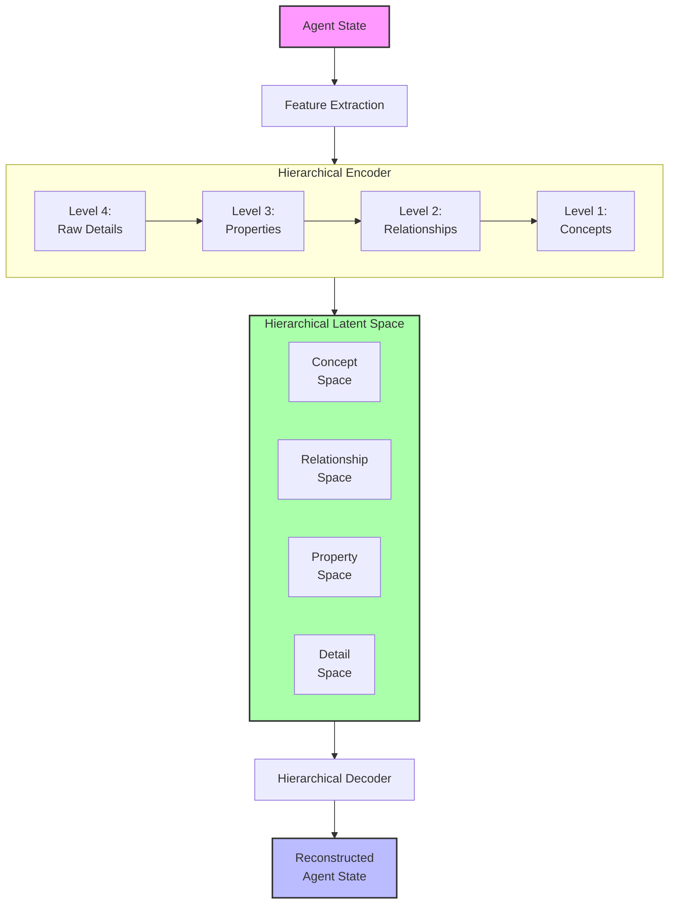
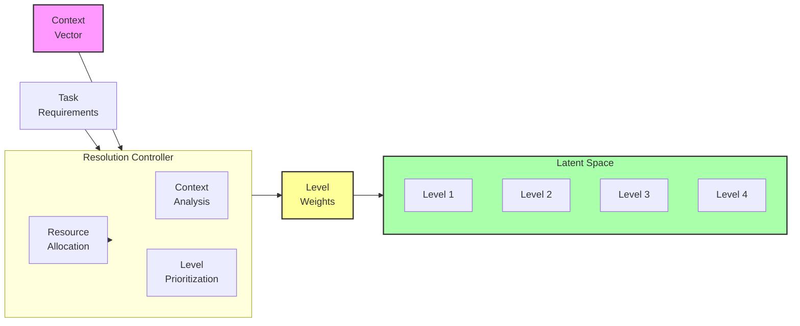
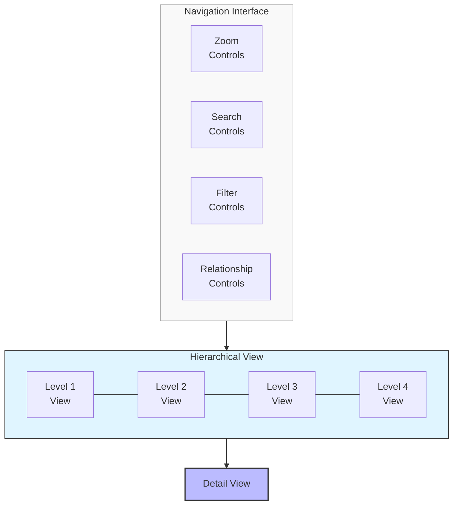

# Hierarchical Meaning Representation: A Research Proposal

## Problem Statement
Current meaning preservation approaches typically operate at a single level of abstraction, treating all semantic elements with equal granularity. However, meaning naturally exists at multiple hierarchical levels—from low-level details to high-level concepts—with complex dependencies between these levels. Without the ability to represent and navigate this hierarchy, systems struggle to adapt compression to different semantic needs and fail to capture the multi-layered nature of meaning. We propose developing a hierarchical meaning representation framework that explicitly models semantic information at multiple levels of abstraction, enabling variable-resolution compression and more nuanced preservation of meaning.

## Proposed Approach

### 1. Multi-Resolution Semantic Encoding
Develop a representation framework that:

- **Explicitly Models Multiple Levels**: From fine-grained details to abstract concepts
- **Preserves Level-Appropriate Information**: Different compression at each level
- **Maintains Cross-Level Dependencies**: Captures how levels influence each other
- **Enables Targeted Access**: Retrieves information at specific abstraction levels

### 2. Adaptive Resolution Mechanisms
Implement systems that:
- Dynamically adjust the level of detail based on context and needs
- Provide variable compression rates for different semantic levels
- Allocate representational capacity based on semantic importance
- Adapt hierarchical structure based on the data and task

### 3. Hierarchical Navigation and Exploration
Create interfaces for:
- Moving between abstraction levels in compressed representations
- Drilling down into details when needed
- Zooming out to understand high-level patterns
- Visualizing relationships between hierarchical levels

## Detailed System Specifications

Each component of the hierarchical meaning representation system is designed to capture and preserve semantic information at multiple levels of abstraction. Here we provide detailed specifications for each component.

### Multi-Resolution Encoder

**Purpose:** Transform agent states into hierarchical representations with multiple levels of semantic abstraction.

**Implementation Details:**
- **Architecture:** Hierarchical variational autoencoder with nested latent spaces
- **Level Structure:**
  - Level 1 (Highest): Abstract concepts, roles, and functions
  - Level 2: Mid-level patterns, relationships, and processes
  - Level 3: Specific properties, attributes, and states
  - Level 4 (Lowest): Raw details and fine-grained information
- **Encoding Process:**
  - Progressive abstraction through stacked encoding layers
  - Explicit disentanglement between hierarchical levels
  - Information bottlenecks of varying strengths at each level
  - Skip connections to preserve level-specific information
- **Key Components:**
  - Level-specific encoders with specialized architectures
  - Inter-level attention mechanisms
  - Hierarchical latent space organization
  - Multi-scale feature extraction

**Expected Capabilities:** Creation of semantic representations that naturally organize information at multiple levels of abstraction, enabling access to both fine details and high-level concepts from the same encoding.

### Adaptive Resolution Controller

**Purpose:** Dynamically adjust the level of semantic detail preserved based on context, task requirements, and computational constraints.

**Implementation Details:**
- **Architecture:** Context-aware controller network with feedback mechanisms
- **Adaptation Criteria:**
  - Task-specific information requirements
  - Computational resource availability
  - Semantic importance at different levels
  - User-specified resolution preferences
- **Control Mechanisms:**
  - Variable strength information bottlenecks
  - Selective attention across hierarchical levels
  - Adaptive quantization of level-specific features
  - Dynamic resource allocation across the hierarchy
- **Key Components:**
  - Context embeddings for task understanding
  - Resource monitoring and allocation system
  - Importance estimation for hierarchical features
  - Resolution adjustment feedback loop

**Expected Capabilities:** Intelligent allocation of representational capacity across semantic levels, enabling optimal preservation of meaning within computational constraints by dynamically adjusting detail levels.

### Hierarchical Decoder

**Purpose:** Reconstruct agent states from hierarchical representations with controllable levels of detail.

**Implementation Details:**
- **Architecture:** Multi-pathway decoder with level-specific generation components
- **Decoding Process:**
  - Top-down generation starting from abstract concepts
  - Conditional detail generation guided by higher levels
  - Parallel reconstruction at multiple detail levels
  - Optional detail injection from specific levels
- **Reconstruction Modes:**
  - Full hierarchical reconstruction
  - Level-specific reconstruction
  - Detail-focused reconstruction with abstract guidance
  - Abstract-focused reconstruction with minimal details
- **Key Components:**
  - Conditional decoders for each hierarchical level
  - Cross-level attention for coherent reconstruction
  - Detail amplification networks
  - Consistency enforcement mechanisms

**Expected Capabilities:** Flexible reconstruction of agent states with controllable levels of detail, enabling generation of representations that prioritize different aspects of meaning based on context.

### Hierarchical Navigation Interface

**Purpose:** Enable intuitive exploration of hierarchical semantic representations by moving between abstraction levels.

**Implementation Details:**
- **Architecture:** Interactive visualization system with multi-scale navigation
- **Interaction Modes:**
  - Semantic zooming across abstraction levels
  - Detail drilling from abstract to specific
  - Abstraction climbing from specific to general
  - Cross-level relationship exploration
- **Visualization Approaches:**
  - Hierarchical node-link diagrams
  - Nested semantic maps
  - Zoomable treemaps of meaning structures
  - Level-filtered feature importance displays
- **Key Components:**
  - Smooth transition animations between levels
  - Semantic search across hierarchical layers
  - Comparative views of different abstraction levels
  - Relationship highlighting across hierarchy

**Expected Capabilities:** Intuitive understanding and exploration of hierarchical meaning representations, enabling users to navigate between abstract concepts and specific details based on their analysis needs.

### Integration with Existing System

The hierarchical meaning representation system integrates with the main meaning preservation framework through:

**Integration Points:**
1. **Hierarchical Latent Space**: Replaces flat latent representations with nested, multi-level encoding
2. **Level-Aware Loss Functions**: Different reconstruction objectives for different semantic levels
3. **Resolution Control API**: Interface for dynamically adjusting detail levels during transformation
4. **Multi-Scale Evaluation**: Metrics for measuring preservation at each hierarchical level

**Data Flow:**
- Agent states are encoded into multi-level representations
- Resolution controller determines appropriate detail for the context
- Decoder reconstructs with level-appropriate detail
- Navigation interface allows exploration across the hierarchy

## Visual Representations

### Diagram 1: Hierarchical Encoding Architecture

### Diagram 2: Adaptive Resolution Control

### Diagram 3: Hierarchical Navigation Interface

## Implementation Plan

1. **Phase 1**: Multi-resolution encoder
   - Develop hierarchical VAE architecture
   - Implement level-specific encoding mechanisms
   - Create hierarchical latent space organization
   - Build initial visualization of level separation

2. **Phase 2**: Adaptive resolution control
   - Implement context-aware resolution controller
   - Develop resource allocation algorithms
   - Create level prioritization mechanisms
   - Build feedback loops for resolution adjustment

3. **Phase 3**: Hierarchical decoder
   - Develop multi-pathway decoder architecture
   - Implement conditional generation across levels
   - Create cross-level consistency mechanisms
   - Build evaluation metrics for each abstraction level

4. **Phase 4**: Navigation and evaluation
   - Develop hierarchical navigation interface
   - Implement semantic zooming functionality
   - Create level-specific evaluation metrics
   - Build comprehensive benchmarking suite for hierarchical preservation

## Expected Outcomes

1. **Variable Resolution Compression**: Ability to compress agent states at different levels of detail based on context

2. **Semantic Scalability**: Representations that can scale from high-level summaries to detailed descriptions

3. **Targeted Preservation**: More efficient allocation of representational capacity to semantically important elements

4. **Improved Explainability**: Better understanding of what aspects of meaning are preserved at each level

5. **Quantifiable Benefits**:
   - 30-50% improved compression efficiency through hierarchical allocation
   - Preservation of high-level meaning even at extreme compression rates
   - More effective adaptation to different task requirements
   - Enhanced interpretability of semantic transformations

## Evaluation Framework

The effectiveness of the hierarchical meaning representation system will be measured through:

1. **Level-Specific Preservation Metrics**:
   - Concept-level preservation accuracy
   - Relationship structure preservation
   - Property accuracy at different levels
   - Detail fidelity metrics

2. **Resolution Adaptation Metrics**:
   - Compression efficiency at different resolution settings
   - Task performance across resolution levels
   - Resource utilization effectiveness
   - Adaptation speed to changing requirements

3. **Navigation Effectiveness**:
   - User ability to locate information at specific levels
   - Cross-level relationship discovery
   - Navigation efficiency metrics
   - User satisfaction with hierarchical exploration

4. **Comparative Analysis**:
   - Against flat representation models
   - Across different hierarchical architectures
   - With varying numbers of abstraction levels
   - Under different resource constraints

This proposal outlines a comprehensive approach to representing meaning at multiple levels of abstraction. By implementing this hierarchical framework, we can significantly enhance the flexibility, efficiency, and expressiveness of meaning preservation systems, enabling more nuanced and context-appropriate semantic transformations. 