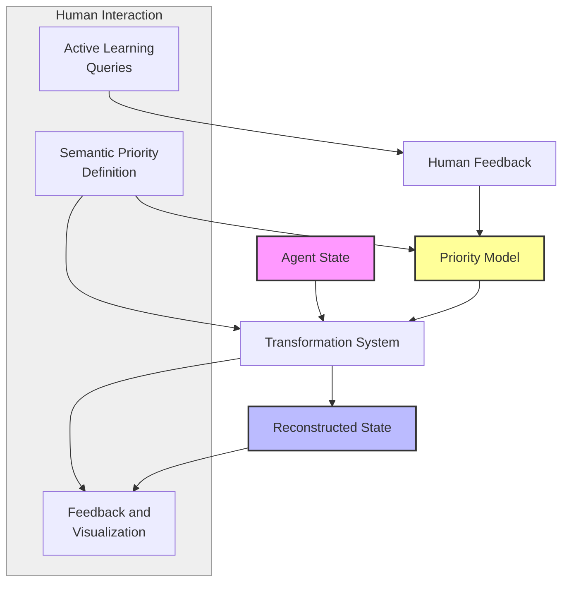
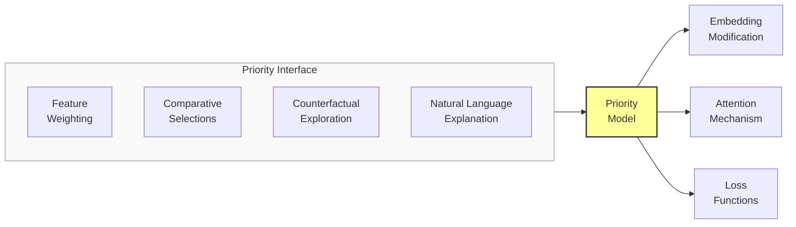
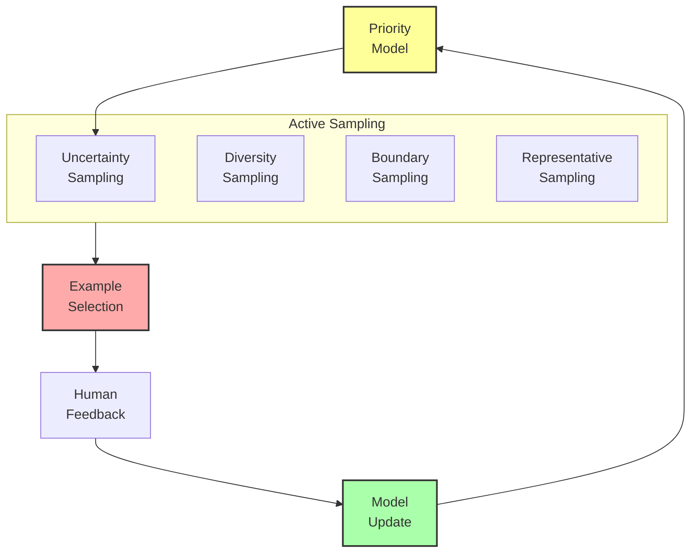

# Interactive Meaning Negotiation System: A Research Proposal

## Problem Statement
Current meaning preservation systems rely on pre-defined, static definitions of what constitutes "meaningful" in agent states. However, meaning is inherently subjective, contextual, and often requires human interpretation to fully capture. Without a mechanism for humans to guide and refine what aspects of meaning should be preserved, systems may optimize for semantic properties that humans don't actually value while missing crucial elements that humans consider essential. We propose developing an interactive meaning negotiation system that enables collaborative definition and refinement of meaning between humans and AI, creating a shared understanding of semantic priorities.

## Proposed Approach

### 1. Human-AI Collaborative Meaning Definition
Create a framework for:

- **Semantic Priority Elicitation**: Methods to extract what humans consider meaningful
- **Disagreement Resolution**: Techniques to address conflicting definitions of meaning
- **Multi-Perspective Integration**: Combining different views of what constitutes meaning
- **Dynamic Refinement**: Evolving definitions based on ongoing interaction

### 2. Interactive Visualization and Feedback
Develop interfaces that:
- Display meaning representations in human-interpretable forms
- Allow direct manipulation of semantic priorities
- Visualize the impact of preservation choices on different meaning aspects
- Facilitate exploration of semantic spaces and relationships

### 3. Active Learning for Meaning Alignment
Implement a system that:
- Identifies areas of semantic uncertainty requiring human input
- Strategically selects examples to maximize learning from human feedback
- Generalizes from specific feedback to broader semantic principles
- Continuously improves alignment with human meaning concepts

## Detailed System Specifications

Each component of the interactive meaning negotiation system is designed to bridge the gap between human and machine understanding of meaning. Here we provide detailed specifications for each component.

### Semantic Priority Elicitation System

**Purpose:** Extract, formalize, and integrate human perspectives on what aspects of meaning are most important to preserve.

**Implementation Details:**
- **Architecture:** Multi-modal interaction framework with diverse elicitation methods
- **Elicitation Methods:**
  - Direct attribute ranking and weighting interfaces
  - Comparative examples ("This preserves meaning better than that")
  - Counterfactual exploration ("Would meaning change if X were different?")
  - Natural language explanation of semantic importance
- **Integration Mechanism:** Bayesian preference learning with:
  - Uncertainty quantification for preferences
  - Confidence-weighted integration of multiple perspectives
  - Consistency checking across elicitation methods
  - Detection of context-dependent priorities
- **Key Components:**
  - Preference modeling system with probabilistic representations
  - Interactive semantic card sorting tools
  - Meaning dimension discovery through factor analysis
  - Priority visualization and validation interfaces

**Expected Capabilities:** Accurate capture of human semantic priorities, representation of preference uncertainty, and integration of potentially conflicting viewpoints into coherent priority models.

### Interactive Visualization System

**Purpose:** Make meaning representations and preservation choices transparent and manipulable by humans.

**Implementation Details:**
- **Architecture:** Multi-level visualization framework with bidirectional interaction
- **Visualization Types:**
  - Feature importance heat maps showing semantic priorities
  - Dimension reduction plots of semantic space
  - Meaning transformation animation showing preservation/loss
  - Before/after comparisons of transformation effects
  - Relationship graphs highlighting structural meaning
- **Interaction Methods:**
  - Direct manipulation of feature weights
  - Guided exploration of semantic space
  - "What-if" scenario testing for different preservation strategies
  - Annotation and marking of meaning-critical regions
- **Key Components:**
  - Real-time rendering of semantic transformations
  - Customizable visualization perspectives
  - Progressive disclosure of complexity
  - Comparative visualization tools
  - Collaborative multi-user interfaces

**Expected Capabilities:** Intuitive understanding of abstract meaning representations, direct manipulation of semantic priorities, and clear visualization of preservation trade-offs.

### Active Learning System

**Purpose:** Efficiently improve meaning alignment through strategic selection of examples for human feedback.

**Implementation Details:**
- **Architecture:** Uncertainty-aware active learning framework with multiple query strategies
- **Selection Criteria:**
  - Uncertainty sampling for ambiguous cases
  - Diversity sampling for broad coverage
  - Adversarial examples challenging current understanding
  - Boundary cases testing semantic thresholds
  - Representative examples for validation
- **Learning Process:**
  - Initial bootstrapping from limited examples
  - Iterative refinement through targeted queries
  - Verification phases to confirm generalization
  - Adaptation to changing semantic priorities
- **Key Components:**
  - Uncertainty quantification in meaning models
  - Sample selection optimization algorithms
  - Feedback integration with weighting by confidence
  - Learning curve analysis and stopping criteria
  - Explanation generation for query selection

**Expected Capabilities:** Dramatic reduction in required human feedback through strategic example selection, rapid convergence to human semantic priorities, and efficient adaptation to changing meaning concepts.

### Meaning Alignment Tracking System

**Purpose:** Monitor, measure, and visualize the degree of alignment between human and AI understanding of meaning.

**Implementation Details:**
- **Architecture:** Multi-metric alignment measurement framework with temporal tracking
- **Alignment Dimensions:**
  - Feature priority alignment
  - Structural understanding alignment
  - Behavioral implication alignment
  - Latent space correspondence
- **Measurement Approaches:**
  - Direct comparison of explicit priorities
  - Implicit testing through prediction tasks
  - Agreement on borderline cases
  - Consistency in applied transformations
- **Key Components:**
  - Alignment dashboards with historical trends
  - Disagreement analysis tools
  - Progress visualization for different meaning aspects
  - Confidence intervals for alignment estimates
  - Targeted recommendations for improving alignment

**Expected Capabilities:** Clear quantification of human-AI semantic alignment, identification of specific areas requiring more negotiation, and verification of improvement over time.

### Integration with Existing System

The interactive meaning negotiation system integrates with the meaning preservation system through:

**Integration Points:**
1. **Preference-Weighted Loss Functions:** Human priorities directly influence optimization objectives
2. **Guided Latent Space Navigation:** Human feedback shapes the organization of the latent space
3. **Attention Mechanism Control:** Human input directs what the system attends to during encoding/decoding
4. **Evaluation Metric Customization:** Alignment with human priorities determines success metrics

**Data Flow:**
- Human feedback is formalized as preference models
- Preference models shape loss functions and attention weights
- Transformation results are visualized for human assessment
- Alignment metrics guide further interaction needs

## Visual Representations

### Diagram 1: Interactive Meaning Negotiation Loop

### Diagram 2: Semantic Priority Interface

### Diagram 3: Active Learning Selection

## Implementation Plan

1. **Phase 1**: Semantic priority elicitation
   - Develop initial priority elicitation interfaces
   - Implement preference learning models
   - Create methods for integrating multiple perspectives
   - Build baseline priority visualization tools

2. **Phase 2**: Interactive visualization system
   - Develop multi-level visualization framework
   - Implement direct manipulation interfaces
   - Create comparative visualization tools
   - Build semantic space exploration interface

3. **Phase 3**: Active learning system
   - Implement uncertainty-based sampling strategies
   - Develop feedback integration mechanisms
   - Create learning curve analysis tools
   - Build explanation system for query selection

4. **Phase 4**: Integration and evaluation
   - Connect negotiation system to transformation pipeline
   - Implement preference-weighted loss functions
   - Develop comprehensive alignment metrics
   - Conduct user studies for system validation

## Expected Outcomes

1. **Human-Aligned Semantics**: Transformation systems that preserve what humans actually consider meaningful

2. **Preference Explicitness**: Clear articulation of previously implicit assumptions about meaning

3. **Feedback Efficiency**: Dramatic reduction in required human input through strategic active learning

4. **Shared Understanding**: Improved human-AI communication about semantic priorities and trade-offs

5. **Quantifiable Benefits**:
   - 80%+ alignment with human semantic priorities after limited interaction
   - 90%+ user satisfaction with meaning preservation choices
   - 5-10x reduction in feedback required through active learning
   - Significant improvement in downstream task performance with human-aligned semantics

## Evaluation Framework

The effectiveness of the interactive meaning negotiation system will be measured through:

1. **Alignment Metrics**:
   - Agreement between human and system semantic priorities
   - Consistency between stated preferences and system behavior
   - Satisfaction with preservation choices in blind tests
   - Generalization to unseen examples

2. **Interaction Efficiency**:
   - Number of interactions required to reach alignment thresholds
   - Time investment to achieve satisfactory results
   - Learning curve steepness across sessions
   - Sustained alignment after system updates

3. **Usability Metrics**:
   - Interface comprehension and ease of use
   - Cognitive load during interaction
   - User confidence in system understanding
   - Preference expression completeness

4. **Comparative Analysis**:
   - Against systems with static meaning definitions
   - Against systems with different elicitation techniques
   - Across users with different backgrounds and expertise
   - Between individual and collaborative negotiations

This proposal outlines a comprehensive approach to involving humans in the definition and refinement of what constitutes meaning in preservation systems. By implementing this interactive negotiation framework, we can create systems that truly align with human semantic priorities, rather than relying on predetermined and potentially misaligned definitions of meaning. 