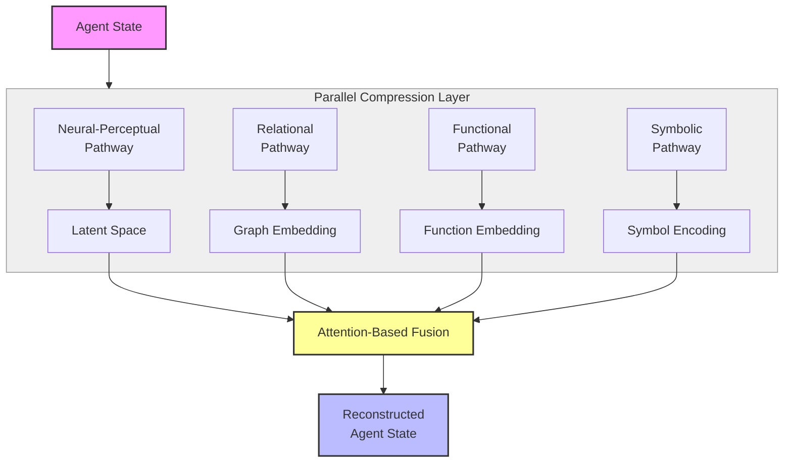
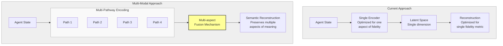
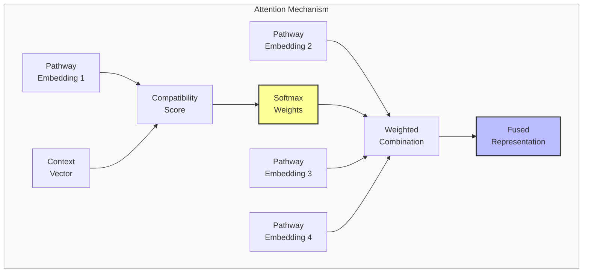

# Multi-Modal Semantic Compression: Preserving Meaning Across Representational Forms

## Problem Statement
The current compression approach prioritizes a single dimension of fidelity (perceptual). However, meaning exists across multiple dimensions simultaneously. We propose a multi-modal compression framework that preserves different aspects of meaning through specialized encoding pathways.

## Proposed Approach

### 1. Multi-Pathway Compression Architecture
Implement parallel compression pathways, each specialized for a different aspect of meaning:

- **Neural-Perceptual Pathway**: VAE optimized for feature-level fidelity
- **Relational Pathway**: Graph-based encoder preserving relationships between elements
- **Functional Pathway**: Information bottleneck model preserving behavior-relevant information
- **Symbolic Pathway**: Discrete encoder preserving rule-based/logical structures

## Detailed Pathway Specifications

Each pathway in our multi-modal compression system is designed to capture and preserve a different aspect of meaning from the agent state. Here we provide detailed specifications for each pathway and how they work together.

### Neural-Perceptual Pathway

**Purpose:** Preserve feature-level statistical patterns and distributions that characterize agent properties.

**Implementation Details:**
- **Architecture:** Variational Autoencoder (VAE) with hierarchical latent space
- **Input Processing:** Continuous features normalized and categorical features one-hot encoded
- **Encoding Process:** Multi-layer encoder with batch normalization and residual connections
- **Latent Representation:** Gaussian distribution parameters (μ, σ) for sampling latent vectors
- **Key Components:**
  - KL-divergence regularization to ensure smooth latent space
  - Feature-weighted reconstruction loss adjusted by importance
  - Perceptual similarity metrics for structural consistency

**Expected Preservation:** Statistical patterns, feature distributions, and correlations between features that characterize the agent's state.

### Relational Pathway

**Purpose:** Capture and preserve relationships and connections between entities in the agent's state.

**Implementation Details:**
- **Architecture:** Graph Neural Network (GNN) with Graph Variational Autoencoder
- **Input Processing:** Agent state converted to knowledge graph with entities as nodes and relationships as edges
- **Encoding Process:**
  - Message passing between connected nodes
  - Edge attribute processing
  - Global pooling for graph-level features
- **Latent Representation:** Node embeddings and graph-level embedding
- **Key Components:**
  - Structure-preserving loss functions (adjacency reconstruction)
  - Path-length preservation metrics
  - Community/cluster preservation techniques

**Expected Preservation:** Entity relationships, network structure, influence patterns, and hierarchical organization that define the agent's relational context.

### Functional Pathway

**Purpose:** Preserve behavior-relevant information that determines how the agent would act in various contexts.

**Implementation Details:**
- **Architecture:** Information Bottleneck model with behavior prediction components
- **Input Processing:** Agent state augmented with action probabilities or behavioral metrics
- **Encoding Process:**
  - Joint compression of state and behavior signals
  - Mutual information maximization between compressed state and behavioral outcomes
  - Progressive bottlenecking to identify minimal sufficient statistics
- **Latent Representation:** Compressed representation optimized for behavior prediction
- **Key Components:**
  - Sufficiency loss (how well the representation predicts behavior)
  - Minimality loss (how compressed the representation is)
  - Counterfactual generation for testing behavioral equivalence

**Expected Preservation:** Causal factors and decision-relevant features that determine the agent's functional responses to situations.

### Symbolic Pathway

**Purpose:** Preserve explicit rules, logical structures, and symbolic knowledge embodied in the agent state.

**Implementation Details:**
- **Architecture:** Discrete Vector Quantized encoder with transformer backbone
- **Input Processing:** Symbolic extraction of rules, facts, and logical relationships
- **Encoding Process:**
  - Transformer encoding of symbolic structures
  - Vector quantization to maintain discrete representation
  - Dictionary learning for common symbolic patterns
- **Latent Representation:** Codebook indices representing discrete symbolic concepts
- **Key Components:**
  - Rule consistency verification
  - Logical entailment preservation
  - Symbolic reasoning capability tests

**Expected Preservation:** Explicit knowledge, rules, categorizations, and logical structures that define the agent's reasoning framework.

### Integration and Fusion Mechanism

The pathways don't operate in isolation but interact through our attention-based fusion mechanism:

**Fusion Process:**
1. **Context Vector Generation:** Based on reconstruction goals and downstream tasks
2. **Pathway Relevance Assessment:** Compute compatibility scores between context vector and each pathway's embedding
3. **Dynamic Weighting:** Apply softmax to compatibility scores to determine pathway weights
4. **Weighted Combination:** Combine pathway representations with learned weights
5. **Adaptive Adjustment:** Update weights based on reconstruction quality feedback

**Integration Techniques:**
- **Cross-Pathway Attention:** Pathways can attend to each other's representations
- **Consistency Regularization:** Penalties for semantic inconsistencies between pathways
- **Task-Specific Adaptation:** Different fusion weights for different downstream tasks
- **Uncertainty-Aware Combination:** Higher weights to pathways with greater certainty in specific contexts

**Training Strategy:**
- Initial separate pre-training of each pathway
- Progressive joint fine-tuning with integrated loss
- Curriculum learning from simple to complex reconstruction tasks
- Adversarial training to identify and address semantic inconsistencies

By combining these pathways, our system can preserve multiple dimensions of meaning simultaneously, allowing for more comprehensive and nuanced semantic compression than single-pathway approaches.

### 2. Fusion Mechanism
Develop a context-aware integration system that:
- Combines representations through attention-based weighting
- Learns optimal fusion parameters based on reconstruction goals
- Adapts weights depending on downstream usage requirements

### 3. Loss Function Framework
Create a composite loss function incorporating:
- Pathway-specific losses (reconstruction, KL divergence, etc.)
- Cross-pathway consistency terms
- Semantic preservation metrics
- Task-oriented behavioral validation

## Visual Representations

### Diagram 1: Multi-Pathway Architecture

### Diagram 2: Comparison with Current Approache

### Diagram 3: Fusion Mechanism Detail

## Implementation Plan

1. **Phase 1**: Implement individual pathways and baseline performance
2. **Phase 2**: Develop fusion mechanism and joint training approach
3. **Phase 3**: Create evaluation framework measuring different aspects of meaning preservation
4. **Phase 4**: Compare against single-pathway approaches and analyze trade-offs

## Related Work and Novelty

While there are approaches that touch on some aspects of this framework, our proposed approach appears to be novel in its comprehensive integration:

1. **Multi-modal representation learning** - Existing approaches combine different data types (text, image, audio), but not different compression methods optimized for distinct semantic aspects of the same data

2. **Ensemble compression techniques** - Current methods use multiple models but typically optimize for the same objective (file size or quality) rather than different dimensions of meaning

3. **Joint embedding spaces** - Common in multimodal learning, but without specialized pathways explicitly designed to preserve different aspects of meaning

4. **Neuro-symbolic approaches** - These combine neural and symbolic representations, but not typically in a compression framework with semantic preservation as the primary goal

The novel aspects of this approach include:
- Explicitly targeting different dimensions of meaning with specialized pathways
- The attention-based fusion mechanism across compression types
- Semantic preservation as the primary objective rather than reconstruction fidelity
- A comprehensive theoretical framework for analyzing how different aspects of meaning respond to transformation

## Expected Outcomes

1. Quantified understanding of which meaning aspects are preserved by different compression methods
2. More robust reconstruction across varied agent states
3. Ability to prioritize different aspects of meaning based on context
4. Framework for analyzing semantic drift across compression levels

This approach would create not just a better compression system but a theoretical framework for understanding how different aspects of meaning respond to transformation and compression. 