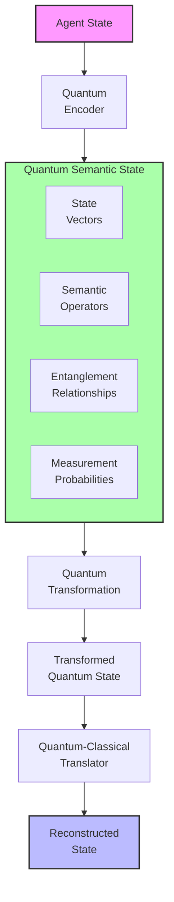
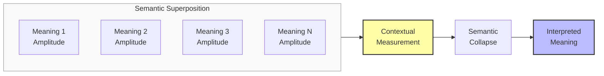
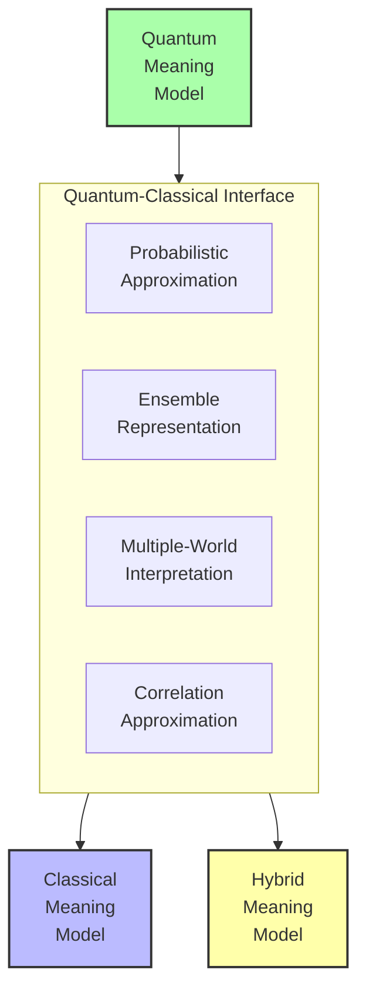

# Quantum-Inspired Semantic Representations: A Research Proposal

## Problem Statement
Conventional meaning preservation approaches rely on classical computational paradigms that struggle to represent certain aspects of semantic phenomena—such as superposition of meanings, contextual entanglement, or the wave-like nature of semantic uncertainty. These classical models often force binary or deterministic representations onto inherently probabilistic, contextual, and relational semantic structures. We propose developing quantum-inspired semantic representations that leverage concepts from quantum mechanics to model the non-classical aspects of meaning, enabling more nuanced preservation of semantic phenomena that resist traditional computational frameworks.

## Proposed Approach

### 1. Quantum Semantic Modeling
Develop representations that:

- **Enable Semantic Superposition**: Model multiple potential meanings simultaneously
- **Capture Semantic Entanglement**: Represent how meanings become interdependent
- **Implement Semantic Interference**: Model how meanings can amplify or cancel each other
- **Apply Contextual Measurement**: Represent how context collapses potential meanings

### 2. Quantum-Inspired Transformation Operations
Implement techniques that:
- Transform quantum semantic states while preserving their non-classical properties
- Compress quantum representations more efficiently than classical approaches
- Maintain entanglement between semantic elements during transformation
- Preserve the probabilistic nature of meaning across transformations

### 3. Quantum-Classical Interfacing
Create frameworks to:
- Translate between quantum-inspired and classical semantic representations
- Explain quantum semantic phenomena in classical terms
- Evaluate quantum semantic preservation with appropriate metrics
- Apply quantum-inspired insights to improve classical approaches

## Detailed System Specifications

Each component of the quantum-inspired semantic representation framework is designed to leverage quantum concepts for modeling meaning in ways that transcend classical limitations. Here we provide detailed specifications for each component.

### Quantum Semantic State Representation

**Purpose:** Create mathematical frameworks for representing semantic content using quantum-inspired formulations that capture non-classical meaning phenomena.

**Implementation Details:**
- **Architecture:** Hilbert space semantic modeling with quantum-inspired operators
- **Representational Elements:**
  - Semantic state vectors in complex Hilbert space
  - Superposition coefficients for potential meanings
  - Semantic operators for meaning transformations
  - Entanglement structures for interdependent meanings
  - Measurement operators for contextual interpretation
- **Mathematical Framework:**
  - Complex vector space formulation
  - Density matrix representations for mixed semantic states
  - Non-commutative semantic operators
  - Tensor product spaces for compositional semantics
  - Quantum-inspired measurement postulates
- **Key Components:**
  - Semantic state initialization system
  - Hilbert space construction for specific domains
  - Operator library for semantic transformations
  - Entanglement creation and management
  - Measurement system for contextual interpretation

**Expected Capabilities:** Representation of semantic phenomena that resist classical modeling, including ambiguity, contextuality, and interdependence, in mathematically rigorous frameworks inspired by quantum formalism.

### Quantum Semantic Dynamics

**Purpose:** Model how quantum-inspired semantic states evolve, transform, and respond to operations in ways that preserve their non-classical properties.

**Implementation Details:**
- **Architecture:** Quantum-inspired semantic evolution system with transformation operators
- **Dynamic Processes:**
  - Unitary evolution of semantic states
  - Non-unitary transformations for irreversible semantic changes
  - Semantic collapse through measurement/interpretation
  - Semantic entanglement creation and modification
  - Quantum-inspired semantic inference
- **Transformation Types:**
  - Semantic rotation (changing meaning emphasis)
  - Semantic phase shift (altering contextual relationship)
  - Semantic entangling (creating meaning dependencies)
  - Semantic measurement (contextual interpretation)
  - Semantic teleportation (meaning transfer protocols)
- **Key Components:**
  - Quantum-inspired semantic evolution engine
  - Transformation operator library
  - Entanglement management system
  - Contextual measurement framework
  - Semantic interference calculator

**Expected Capabilities:** Modeling of semantic transformations that maintain the quantum-like properties of meaning, enabling preservation of superposition, entanglement, and other non-classical semantic phenomena.

### Quantum Semantic Compression

**Purpose:** Achieve more efficient semantic compression by leveraging quantum-inspired principles like superposition and entanglement.

**Implementation Details:**
- **Architecture:** Quantum-inspired compression framework with entanglement preservation
- **Compression Approaches:**
  - Superposition-based ambiguity preservation
  - Entanglement-preserving factorization
  - Quantum-inspired dimensionality reduction
  - Semantic eigendecomposition for efficient encoding
  - Interference-based redundancy elimination
- **Optimization Objectives:**
  - Maximize superposition preservation
  - Maintain entanglement structures
  - Preserve measurement statistics
  - Minimize quantum-equivalent of von Neumann entropy
  - Ensure reversibility where appropriate
- **Key Components:**
  - Quantum-inspired compression algorithms
  - Entanglement-aware encoding systems
  - Semantic fidelity metrics for quantum states
  - Efficient tensor decomposition techniques
  - Quantum-classical compression bridges

**Expected Capabilities:** More efficient and semantically faithful compression of meaning representations that preserve quantum-like properties, achieving higher compression ratios without sacrificing semantic richness.

### Quantum-Classical Semantic Interface

**Purpose:** Create methods for translating between quantum-inspired and classical semantic representations, enabling practical application and integration.

**Implementation Details:**
- **Architecture:** Bidirectional translation framework with fidelity guarantees
- **Interface Challenges:**
  - Representing superposition in classical terms
  - Explaining entanglement in accessible ways
  - Translating measurement-induced collapse
  - Bridging quantum and classical inference
  - Managing the complexity-clarity trade-off
- **Translation Approaches:**
  - Probabilistic approximation of quantum states
  - Classical ensemble representations
  - Multiple-world interpretations for superposition
  - Correlation-based approximations of entanglement
  - Hybrid quantum-classical representations
- **Key Components:**
  - Quantum-to-classical semantic translator
  - Classical-to-quantum semantic encoder
  - Fidelity comparison metrics
  - Explanation generation for quantum phenomena
  - User-adaptable interpretation interfaces

**Expected Capabilities:** Practical bridges between quantum-inspired semantic models and classical systems, enabling the benefits of quantum-inspired approaches while maintaining compatibility with existing frameworks.

### Integration with Existing System

The quantum-inspired semantic representation framework integrates with the main meaning preservation system through:

**Integration Points:**
1. **Quantum-Enhanced Encoder**: Augments classical encoding with quantum-inspired elements
2. **Hybrid Transformation Pipeline**: Parallel quantum and classical processing paths
3. **Quantum-Inspired Loss Functions**: Objectives that incorporate quantum semantic principles
4. **Quantum-Classical Evaluation Bridge**: Metrics that work across paradigms

**Data Flow:**
- Agent states are encoded into quantum-inspired representations
- Quantum semantic transformations preserve non-classical properties
- Quantum-classical interface enables integrated processing
- Evaluation considers both classical and quantum-inspired metrics
- Results inform refinement of both classical and quantum approaches

## Visual Representations

### Diagram 1: Quantum Semantic State Representation

### Diagram 2: Semantic Superposition and Measurement

### Diagram 3: Quantum-Classical Semantic Interface

## Implementation Plan

1. **Phase 1**: Quantum semantic state representation
   - Develop Hilbert space semantic modeling framework
   - Implement semantic state vectors and operators
   - Create entanglement representation systems
   - Build contextual measurement mechanisms
   - Develop mathematical foundations for quantum semantics

2. **Phase 2**: Quantum semantic dynamics
   - Implement quantum-inspired semantic evolution engine
   - Develop transformation operator library
   - Create entanglement management system
   - Build contextual measurement framework
   - Implement semantic interference calculations

3. **Phase 3**: Quantum semantic compression
   - Develop superposition-based compression techniques
   - Implement entanglement-preserving factorization
   - Create quantum-inspired dimensionality reduction
   - Build semantic eigendecomposition systems
   - Develop interference-based redundancy elimination

4. **Phase 4**: Quantum-classical interfacing and evaluation
   - Implement quantum-to-classical semantic translator
   - Develop classical-to-quantum semantic encoder
   - Create hybrid quantum-classical representations
   - Build evaluation metrics for quantum semantic fidelity
   - Integrate with existing meaning preservation framework

## Expected Outcomes

1. **Enhanced Representation**: More nuanced modeling of ambiguity, context-dependence, and relational meaning

2. **Improved Compression**: Higher compression ratios while preserving semantic richness

3. **Novel Insights**: New understanding of meaning derived from quantum-inspired perspectives

4. **Practical Applications**: Quantum-inspired techniques that enhance classical approaches

5. **Quantifiable Benefits**:
   - 20-40% improvement in ambiguity preservation
   - Better modeling of context-dependent meaning shifts
   - More efficient representation of entangled semantic concepts
   - Novel metrics for evaluating semantic fidelity in non-classical ways

## Evaluation Framework

The effectiveness of the quantum-inspired semantic representation framework will be measured through:

1. **Quantum Semantic Fidelity Metrics**:
   - Superposition preservation accuracy
   - Entanglement maintenance measures
   - Interference pattern preservation
   - Measurement statistics consistency

2. **Comparative Analysis**:
   - Against classical representation approaches
   - For specifically non-classical semantic phenomena
   - Across different semantic domains and contexts
   - In terms of compression efficiency and semantic richness

3. **Theoretical Soundness**:
   - Mathematical consistency of the quantum-inspired framework
   - Alignment with established quantum formalism
   - Interpretability of quantum semantic concepts
   - Theoretical limitations and boundary conditions

4. **Practical Utility**:
   - Applicability to real-world semantic challenges
   - Computational efficiency of implementation
   - Insights generated for semantic understanding
   - Integration potential with existing frameworks

This proposal outlines a pioneering approach to semantic representation that draws inspiration from quantum mechanics to model non-classical aspects of meaning. By implementing this framework, we can extend our ability to represent and preserve semantic phenomena that resist classical modeling, potentially unlocking new insights and capabilities in meaning preservation. 