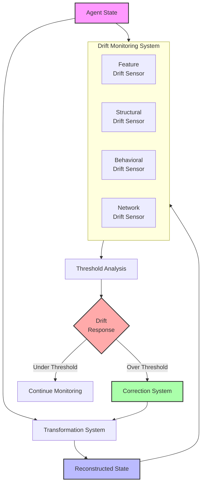
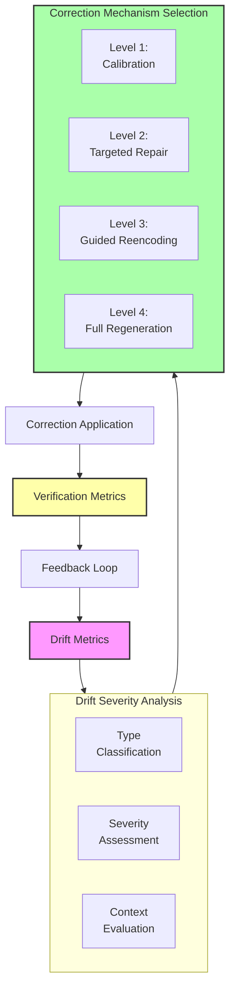
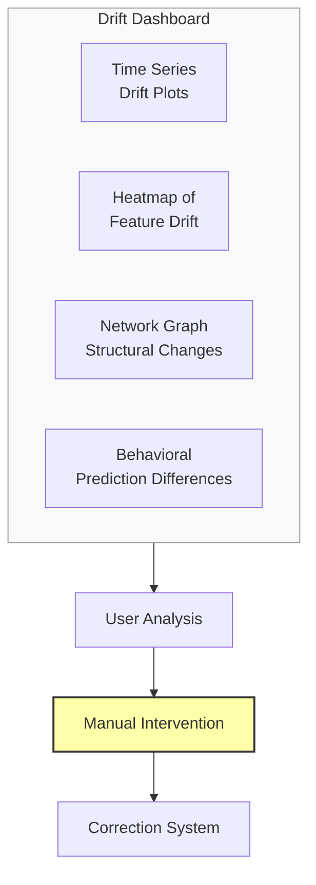

# Semantic Drift Monitoring and Correction Framework: A Research Proposal

## Problem Statement
As agent states undergo multiple transformations, compression cycles, and reconstructions, they gradually accumulate semantic distortions—a phenomenon we call "semantic drift." Current approaches lack robust mechanisms to detect, quantify, and correct this drift in real-time. This leads to progressive meaning degradation that can compromise the integrity of the entire system. We propose developing a comprehensive framework for monitoring semantic drift and implementing targeted correction mechanisms when drift exceeds acceptable thresholds.

## Proposed Approach

### 1. Multi-Dimensional Drift Detection System
Implement a multi-faceted monitoring system that tracks drift across:

- **Feature-Level Drift**: Changes in statistical properties of individual features
- **Structural Drift**: Alterations in relationships between features
- **Behavioral Drift**: Changes in how the agent would act in standard scenarios
- **Semantic Network Drift**: Shifts in the topology of meaning relationships

### 2. Threshold-Based Correction Triggers
Develop an adaptive system that:
- Establishes baselines for acceptable drift in different contexts
- Monitors drift metrics in real-time during system operation
- Triggers correction mechanisms when thresholds are exceeded
- Learns from correction patterns to improve future transformations

### 3. Targeted Correction Mechanisms
Implement specialized correction strategies for different types of drift:
- **Feature Recalibration**: Adjust feature values to restore statistical properties
- **Structural Reinforcement**: Strengthen weakened relational connections
- **Behavioral Alignment**: Optimize for action consistency with original state
- **Semantic Anchoring**: Re-establish connections to stable reference points

## Detailed System Specifications

Each component of the drift monitoring and correction framework is designed to address specific aspects of semantic preservation. Here we provide detailed specifications for each component.

### Drift Detection System

**Purpose:** Continuously monitor and quantify semantic changes across multiple transformation cycles.

**Implementation Details:**
- **Architecture:** Multi-modal drift sensors attached to each transformation pathway
- **Monitoring Process:**
  - Parallel tracking of different drift dimensions (feature, structural, behavioral, semantic)
  - Calculation of drift velocity and acceleration metrics
  - Anomaly detection for sudden drift spikes
- **Baseline Establishment:** Auto-calibration phase that determines normal vs. abnormal drift patterns
- **Key Components:**
  - Reference state repository for long-term comparison
  - Drift signature analysis algorithms
  - Time-series drift tracking with temporal patterns
  - Uncertainty quantification for drift measurements

**Expected Capabilities:** Precise quantification of semantic changes, early warning of problematic drift trends, and differentiation between normal and potentially harmful semantic transformations.

### Threshold Management System

**Purpose:** Define and dynamically adjust acceptable limits for different types of semantic drift.

**Implementation Details:**
- **Architecture:** Hierarchical threshold framework with context-sensitive parameters
- **Threshold Types:**
  - Hard limits for critical semantic properties
  - Soft thresholds with increasing correction urgency
  - Relative thresholds based on baseline drift rates
  - Cumulative thresholds for long-term drift management
- **Adaptation Mechanism:** Threshold learning based on:
  - Observed system performance
  - User feedback on semantic adequacy
  - Task-specific requirements
  - Historical drift patterns
- **Key Components:**
  - Context-aware threshold adjustment
  - Multi-level alarm system
  - Priority assignment for correction actions
  - Visualization dashboard for threshold management

**Expected Capabilities:** Balanced sensitivity to semantic changes, appropriate triggering of corrections, and adaptation to different operational contexts.

### Correction Mechanism System

**Purpose:** Apply targeted interventions to restore semantic integrity when drift exceeds acceptable limits.

**Implementation Details:**
- **Architecture:** Tiered correction framework with escalating intervention levels
- **Correction Types:**
  - Level 1: Subtle calibration of drift-affected components
  - Level 2: Targeted reconstruction of specific semantic elements
  - Level 3: Guided re-encoding with semantic constraints
  - Level 4: Complete regeneration with reference state guidance
- **Selection Logic:** Intervention selection based on:
  - Drift type and severity
  - Affected semantic components
  - Computational resources available
  - Downstream usage requirements
- **Key Components:**
  - Minimal-disruption correction planning
  - Semantic patch generation and application
  - Correction verification and validation
  - Learning from correction effectiveness

**Expected Capabilities:** Efficient restoration of semantic integrity, minimal disruption to system operation, and progressive improvement in correction strategies.

### Integration with Existing System

The drift monitoring and correction framework integrates with the meaning preservation system through:

**Integration Points:**
1. **Transformation Pipeline Instrumentation:** Drift sensors at key points in the pipeline
2. **Feedback Loops:** Correction signals that influence encoding/decoding parameters
3. **Learning Mechanism:** Updates to transformation models based on drift patterns
4. **User Interface:** Dashboard for monitoring and manual intervention when needed

**Data Flow:**
- Continuous drift metrics feed into the threshold system
- Threshold violations trigger appropriate correction mechanisms
- Correction results are verified and fed back into the learning system
- Drift patterns inform improvements to the underlying transformation models

## Visual Representations

### Diagram 1: Drift Monitoring System Architecture

### Diagram 2: Correction Mechanism Selection

### Diagram 3: Drift Visualization Dashboard

## Implementation Plan

1. **Phase 1**: Drift detection and measurement system
   - Develop feature-level drift metrics
   - Implement structural and relational drift detection
   - Create behavioral equivalence comparison tools
   - Build integrated drift visualization dashboard

2. **Phase 2**: Threshold management and triggering system
   - Establish baseline drift patterns across different scenarios
   - Develop adaptive threshold algorithms
   - Implement context-aware threshold adjustment
   - Create alert and notification system for threshold violations

3. **Phase 3**: Correction mechanism development
   - Implement tiered correction strategies
   - Develop selection logic for appropriate interventions
   - Create verification system for correction effectiveness
   - Build learning mechanism to improve corrections over time

4. **Phase 4**: System integration and validation
   - Integrate drift monitoring into transformation pipeline
   - Connect correction triggers to intervention mechanisms
   - Develop comprehensive testing suite for the entire system
   - Conduct longitudinal tests of drift management effectiveness

## Expected Outcomes

1. **Enhanced Stability**: Significantly reduced semantic drift over multiple transformation cycles

2. **Early Warning System**: Detection of semantic degradation before it reaches critical levels

3. **Targeted Intervention**: Precise correction of specific meaning distortions without disrupting intact semantic elements

4. **Self-Improvement**: System that learns from drift patterns to enhance transformation quality

5. **Quantifiable Benefits**:
   - Extended semantic lifetime for agent states
   - Higher compression ratios without meaning loss
   - Improved performance in long-term agent simulations
   - Better trust in semantic consistency across transformations

## Evaluation Framework

The effectiveness of the drift monitoring and correction system will be measured through:

1. **Longitudinal Drift Metrics**:
   - Drift accumulation rates with and without correction
   - Time to critical drift with different threshold settings
   - Correction effectiveness across multiple cycles
   - Long-term semantic stability measurements

2. **Correction Quality Metrics**:
   - Precision of targeted corrections
   - Minimal invasiveness of interventions
   - Restoration completeness after correction
   - Side-effect minimization in interconnected properties

3. **System Efficiency**:
   - Computational overhead of monitoring system
   - Latency between drift detection and correction
   - Resource requirements for different correction levels
   - Overall system throughput with active drift management

4. **Comparative Analysis**:
   - Against systems without drift monitoring
   - Against fixed-schedule regeneration approaches
   - Against different threshold strategies
   - Against manual human correction

This proposal outlines a comprehensive approach to monitoring and correcting semantic drift in meaning-preserving transformation systems. By implementing this framework, we can significantly extend the semantic integrity of agent states across multiple transformation cycles, enabling more reliable and long-lived agent simulations. 