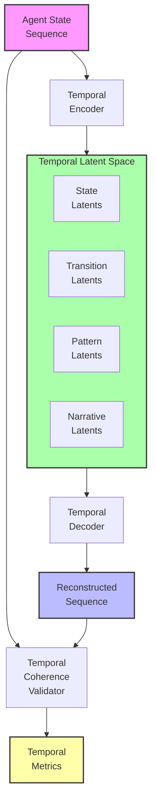
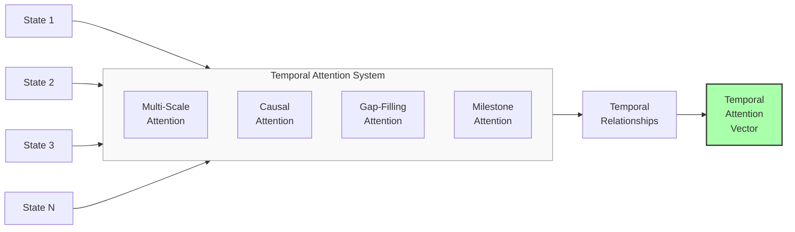
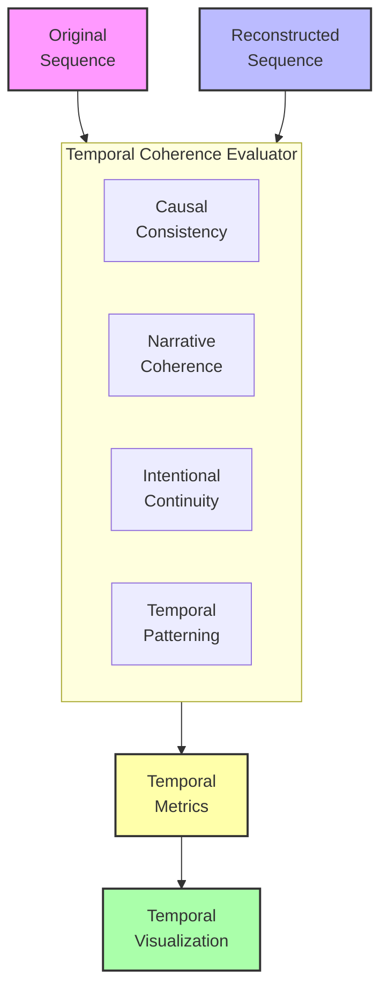

# Temporal Meaning Preservation: A Research Proposal

## Problem Statement
Current meaning preservation approaches focus almost exclusively on static agent states, treating each state as an isolated snapshot. However, meaning often emerges from patterns across time—causal relationships, narratives, intentions, and trajectories—that cannot be captured by examining states in isolation. Without preserving temporal relationships, we lose critical aspects of meaning related to how states evolve and influence each other. We propose developing a temporal meaning preservation framework that explicitly models, encodes, and preserves the semantic connections between agent states across time, maintaining narrative coherence and causal relationships.

## Proposed Approach

### 1. Temporal Semantic Modeling
Develop representations that:

- **Capture State Transitions**: Model how agent states evolve over time
- **Preserve Causal Relationships**: Maintain cause-effect links between states
- **Encode Narrative Structure**: Capture story arcs and meaningful sequences
- **Represent Intentions and Goals**: Model teleological aspects across time

### 2. Sequence-Aware Transformation
Implement systems that:
- Transform sequences of states while maintaining their relationships
- Compress temporal patterns more efficiently than state-by-state approaches
- Adaptively allocate representational capacity to semantically significant transitions
- Preserve different types of temporal dependencies (causal, narrative, intentional)

### 3. Temporal Coherence Evaluation
Create frameworks to:
- Measure preservation of semantic continuity across reconstructed sequences
- Evaluate causal relationship maintenance between states
- Assess narrative coherence in reconstructed trajectories
- Compare temporal patterns and rhythms between original and reconstructed sequences

## Detailed System Specifications

Each component of the temporal meaning preservation framework is designed to capture and maintain semantic relationships across time. Here we provide detailed specifications for each component.

### Temporal Semantic Encoder

**Purpose:** Transform sequences of agent states into representations that capture meaningful temporal patterns and relationships.

**Implementation Details:**
- **Architecture:** Recurrent-augmented transformer with hierarchical attention
- **Encoding Layers:**
  - State-level encoding for individual time points
  - Transition encoding for sequential relationships
  - Pattern encoding for recurring temporal structures
  - Narrative encoding for overarching trajectories
- **Temporal Attention Mechanisms:**
  - Multi-scale temporal attention spanning different time horizons
  - Causal attention for identifying cause-effect relationships
  - Gap-filling attention for inferring missing states
  - Milestone attention for semantically significant events
- **Key Components:**
  - Temporal embedding generators
  - Causal discovery modules
  - Narrative structure extractors
  - Event significance estimators

**Expected Capabilities:** Creation of rich temporal representations that preserve not just individual states but the meaningful relationships between them across time, capturing narrative arcs, causal chains, and intentional trajectories.

### Sequence Transformation System

**Purpose:** Transform and compress sequences of agent states while preserving temporal semantic relationships.

**Implementation Details:**
- **Architecture:** Sequence-to-sequence variational autoencoder with temporal bottlenecks
- **Transformation Process:**
  - Joint compression of related states
  - Temporal dependency preservation through structured latent space
  - Variable compression rates based on semantic significance
  - Explicit modeling of transformation impact on causality
- **Compression Strategies:**
  - Temporal pattern identification and encoding
  - Redundancy elimination across the time dimension
  - Event-based keyframe selection and interpolation
  - Causal structure preservation with minimal state representation
- **Key Components:**
  - Temporal VAE with structured latent space
  - Semantic keyframe extractor
  - Causal structure encoder
  - Temporal consistency enforcers

**Expected Capabilities:** Efficient transformation of state sequences that maintains semantic relationships across time, achieving higher compression ratios than state-by-state approaches while better preserving temporal aspects of meaning.

### Temporal Coherence Validator

**Purpose:** Evaluate how well transformed sequences preserve meaningful temporal relationships and patterns.

**Implementation Details:**
- **Architecture:** Multi-metric evaluation framework with reference alignment
- **Evaluation Dimensions:**
  - Causal consistency between original and reconstructed sequences
  - Narrative coherence and story arc preservation
  - Intentional continuity and goal-directedness
  - Event significance alignment across sequences
  - Temporal rhythm and pacing preservation
- **Measurement Approaches:**
  - Causal graph comparison between sequences
  - Narrative structure alignment metrics
  - Intention and goal tracking across time
  - Event detection and significance comparison
- **Key Components:**
  - Causal model extractors and comparators
  - Narrative coherence quantifiers
  - Intention tracking systems
  - Event detection and alignment tools
  - Temporal pattern recognition algorithms

**Expected Capabilities:** Comprehensive assessment of how well transformation systems preserve the temporal aspects of meaning, providing specific metrics for different dimensions of temporal semantic preservation.

### Temporal Visualization System

**Purpose:** Provide intuitive visualization of temporal meaning preservation and highlight differences between original and reconstructed sequences.

**Implementation Details:**
- **Architecture:** Interactive multi-view visualization framework
- **Visualization Types:**
  - Parallel timeline comparisons
  - Causal graph visualizations
  - Narrative arc diagrams
  - Event significance heat maps
  - State transition animations
  - Difference highlighting views
- **Interaction Features:**
  - Timeline navigation and zooming
  - Event filtering and focusing
  - Causal chain exploration
  - Comparative playback of sequences
  - Semantic difference inspection
- **Key Components:**
  - Timeline rendering engine
  - Causal graph layout algorithms
  - Narrative structure visualizers
  - Interactive comparison tools
  - Temporal anomaly highlighters

**Expected Capabilities:** Intuitive visualization of temporal semantic preservation, enabling users to understand how well causal relationships, narratives, and other temporal aspects of meaning are maintained across transformations.

### Integration with Existing System

The temporal meaning preservation framework integrates with the main meaning preservation system through:

**Integration Points:**
1. **Temporal Context Enhancement**: Enriches single-state processing with temporal context
2. **Sequence-Aware Transformation**: Extends transformation pipeline to process sequences
3. **Temporal Loss Functions**: Adds temporal coherence terms to optimization objectives
4. **Expanded Evaluation Framework**: Incorporates temporal metrics into preservation assessment

**Data Flow:**
- Sequences of agent states are collected and temporally encoded
- Temporal relationships are explicitly modeled and preserved during transformation
- Reconstructed sequences are evaluated for temporal coherence
- Visualization tools highlight temporal aspects of meaning preservation

## Visual Representations

### Diagram 1: Temporal Meaning Preservation Architecture

### Diagram 2: Temporal Attention Mechanism

### Diagram 3: Temporal Coherence Evaluation

## Implementation Plan

1. **Phase 1**: Temporal semantic modeling
   - Develop recurrent-augmented transformer for sequence encoding
   - Implement multi-scale temporal attention mechanisms
   - Create causal relationship discovery components
   - Build narrative structure extraction tools
   - Construct event significance estimation system

2. **Phase 2**: Sequence transformation
   - Implement sequence-to-sequence VAE architecture
   - Develop temporal pattern compression techniques
   - Create causal structure preservation mechanisms
   - Build semantic keyframe selection system
   - Construct temporal consistency enforcement

3. **Phase 3**: Temporal coherence evaluation
   - Develop causal graph comparison metrics
   - Implement narrative coherence quantification
   - Create intention and goal tracking systems
   - Build event significance alignment metrics
   - Construct temporal pattern recognition and comparison

4. **Phase 4**: Visualization and integration
   - Develop interactive temporal visualization system
   - Implement parallel timeline comparison tools
   - Create causal graph visualization components
   - Build narrative arc visualization system
   - Integrate temporal preservation with existing framework

## Expected Outcomes

1. **Narrative Coherence**: Preservation of meaningful story arcs and sequences across transformations

2. **Causal Maintenance**: Retention of cause-effect relationships between agent states

3. **Intentional Continuity**: Preservation of goal-directed behavior and intentions across time

4. **Temporal Compression**: More efficient representation of state sequences through temporal pattern encoding

5. **Quantifiable Benefits**:
   - 40-60% better preservation of causal relationships compared to state-by-state approaches
   - 20-30% improvement in compression efficiency for temporally redundant information
   - Significantly higher narrative coherence ratings from human evaluators
   - Better prediction of future states based on preserved temporal patterns

## Evaluation Framework

The effectiveness of the temporal meaning preservation framework will be measured through:

1. **Causal Preservation Metrics**:
   - Causal graph structural similarity
   - Intervention consistency between sequences
   - Counterfactual alignment across transformations
   - Causal information flow preservation

2. **Narrative Coherence Metrics**:
   - Story arc preservation score
   - Plot point alignment accuracy
   - Character/agent arc consistency
   - Narrative tension curve similarity

3. **Intentional Continuity Metrics**:
   - Goal preservation across sequences
   - Plan consistency measurement
   - Intention attribution alignment
   - Progress tracking consistency

4. **Comparative Analysis**:
   - Against state-by-state transformation approaches
   - Across different temporal scales (short vs. long sequences)
   - With varying degrees of causal complexity
   - Under different compression requirements

This proposal outlines a comprehensive approach to preserving meaningful temporal relationships in agent state transformations. By implementing this framework, we can significantly enhance our ability to maintain narrative coherence, causal relationships, and intentional structures across transformations, capturing aspects of meaning that emerge only across time. 