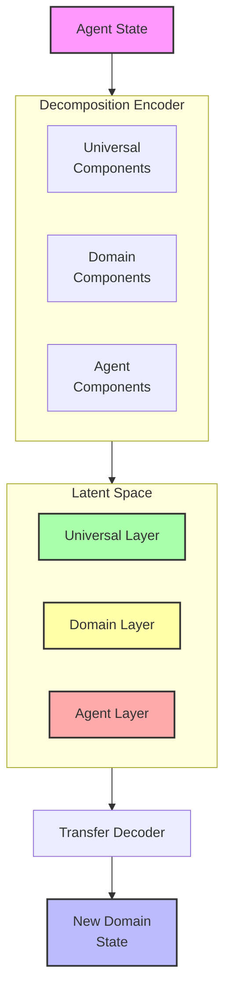
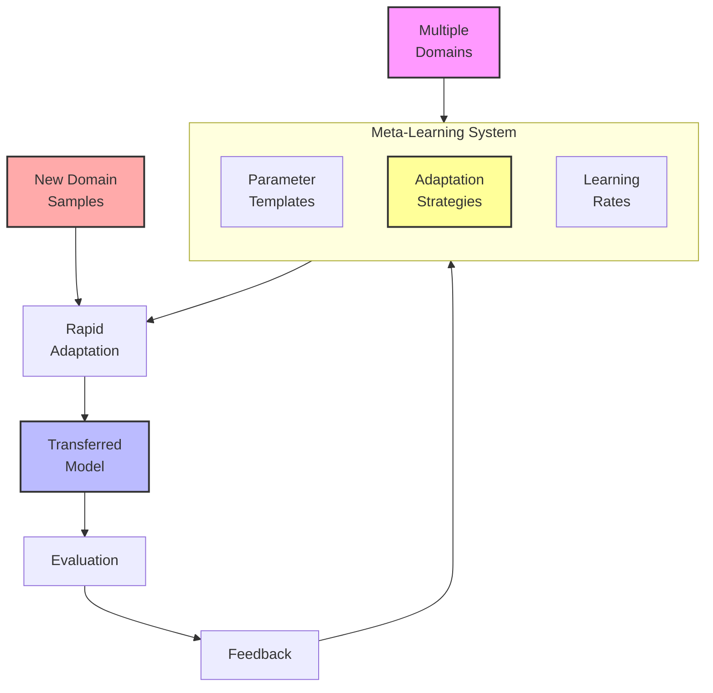
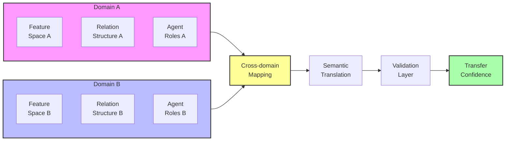

# Transfer Learning for Meaning Preservation: A Research Proposal

## Problem Statement
Current meaning preservation systems are typically trained on specific agent types within particular domains, limiting their generalizability. When faced with new agent types, roles, or environments, these systems often require complete retraining—a time-consuming and resource-intensive process. We propose developing transfer learning techniques that allow meaning representations to be effectively transferred across different domains and agent types, preserving the shared aspects of meaning while efficiently adapting to context-specific elements.

## Proposed Approach

### 1. Universal-Contextual Meaning Decomposition
Develop a framework that separates meaning representations into:

- **Universal Components**: Core semantic elements that remain consistent across domains
- **Domain-Specific Components**: Context-dependent elements that require adaptation
- **Agent-Specific Components**: Elements unique to particular agent types or roles

### 2. Meta-Learning for Rapid Adaptation
Implement a meta-learning system that:
- Learns how to efficiently adapt meaning encoders to new domains
- Identifies which parts of the representation require adaptation
- Minimizes data requirements for new domains through few-shot learning
- Preserves previously learned semantic knowledge

### 3. Cross-Domain Semantic Mapping
Create mechanisms for:
- Establishing correspondence between domains with different feature spaces
- Translating meaning representations across contextual boundaries
- Preserving relational structures even when base features differ
- Validating semantic consistency across domain transitions

## Detailed System Specifications

Each component of the transfer learning framework is designed to address specific aspects of cross-domain meaning preservation. Here we provide detailed specifications for each component.

### Universal-Contextual Decomposition System

**Purpose:** Separate meaning representations into transferable universal components and domain-specific elements.

**Implementation Details:**
- **Architecture:** Modular encoder with shared and domain-specific pathways
- **Decomposition Process:**
  - Information bottleneck to isolate universal features
  - Domain adversarial training to identify domain-invariant components
  - Mutual information analysis between features and domains
  - Progressive abstraction to find common semantic structures
- **Representation Structure:** Hierarchical embedding space with:
  - Core layer of universal semantic features
  - Domain adaptation layers for context adjustment
  - Agent-specific layers for role customization
- **Key Components:**
  - Domain classifier with gradient reversal for invariance learning
  - Contrastive learning framework for universal feature extraction
  - Semantic feature attribution system for decomposition analysis
  - Disentanglement metrics for evaluating separation quality

**Expected Capabilities:** Clean separation of transferable semantic elements from domain-specific details, enabling more efficient adaptation while preserving core meaning structures.

### Meta-Learning Adaptation System

**Purpose:** Enable rapid adaptation of meaning preservation systems to new domains with minimal data and computation.

**Implementation Details:**
- **Architecture:** MAML-inspired meta-learning framework specialized for semantic transfer
- **Learning Process:**
  - Episodic training across diverse domains to learn adaptation strategies
  - Gradient-based meta-learning with semantic consistency constraints
  - Few-shot fine-tuning protocols for new domains
  - Continual learning with catastrophic forgetting prevention
- **Adaptation Mechanism:** Targeted parameter updates based on:
  - Feature space mapping between domains
  - Prototype alignment for similar semantic concepts
  - Transfer difficulty assessment
  - Semantic validation feedback
- **Key Components:**
  - Domain similarity calculator for transfer strategy selection
  - Parameter efficiency analysis for minimal adaptation
  - Transfer learning curriculum generator
  - Adaptation verification through semantic preservation metrics

**Expected Capabilities:** Dramatic reduction in data and computation requirements when adapting to new domains, while maintaining high-quality meaning preservation across transitions.

### Cross-Domain Mapping System

**Purpose:** Establish correspondences between different domains and enable meaningful translation of semantic representations.

**Implementation Details:**
- **Architecture:** Neural translation framework with domain embedding mechanisms
- **Mapping Process:**
  - Feature space alignment through optimal transport
  - Relational structure preservation despite feature differences
  - Semantic concept matching across domain boundaries
  - Bidirectional consistency verification
- **Translation Strategies:**
  - Direct feature mapping where correspondence exists
  - Functional equivalence mapping for different but related features
  - Compositional mapping for complex cross-domain concepts
  - Analogical reasoning for novel translations
- **Key Components:**
  - Domain ontology matching system
  - Cross-domain similarity matrices
  - Translation confidence estimation
  - Semantic preservation validation

**Expected Capabilities:** Reliable translation of meaning representations between domains with different feature spaces, preserving semantic relationships even when the underlying representations differ significantly.

### Integration with Existing System

The transfer learning framework integrates with the meaning preservation system through:

**Integration Points:**
1. **Modular Encoder/Decoder**: Components that separate universal from domain-specific processing
2. **Adaptation Interface**: Meta-learning system that connects to existing parameters
3. **Domain Registry**: Database of known domains and their semantic characteristics
4. **Translation Layer**: Cross-domain mapping system that connects different semantic spaces

**Data Flow:**
- New domains are analyzed for similarity to known domains
- Appropriate transfer strategies are selected based on domain analysis
- Universal components are preserved while domain-specific elements are adapted
- Cross-domain translations are applied when operating across domain boundaries

## Visual Representations

### Diagram 1: Universal-Contextual Decomposition

### Diagram 2: Meta-Learning Adaptation Process

### Diagram 3: Cross-Domain Semantic Mapping

## Implementation Plan

1. **Phase 1**: Universal-contextual decomposition
   - Develop architecture for separating universal and domain-specific components
   - Implement domain adversarial training for invariant feature learning
   - Create evaluation metrics for decomposition quality
   - Build visualization tools for universal vs. domain-specific features

2. **Phase 2**: Meta-learning framework
   - Implement gradient-based meta-learning for semantic representations
   - Develop few-shot adaptation protocols for new domains
   - Create domain similarity assessment tools
   - Build domain registry and adaptation strategy database

3. **Phase 3**: Cross-domain mapping
   - Develop feature space alignment techniques
   - Implement relational structure preservation mechanisms
   - Create bidirectional consistency verification tools
   - Build confidence estimation for cross-domain translations

4. **Phase 4**: Integrated system and evaluation
   - Connect all components into unified transfer learning framework
   - Develop comprehensive benchmarks across multiple domains
   - Create visualization tools for transfer effectiveness
   - Conduct comparative analysis against domain-specific systems

## Expected Outcomes

1. **Efficient Adaptation**: Dramatically reduced data and computational requirements when moving to new domains

2. **Knowledge Preservation**: Retention of universal semantic knowledge across domain transitions

3. **Cross-Domain Translation**: Ability to map meaning representations between domains with different feature spaces

4. **Domain Insights**: Better understanding of which aspects of meaning are universal vs. context-specific

5. **Quantifiable Benefits**:
   - 10-100x reduction in training data requirements for new domains
   - Preservation of 80%+ of semantic structures across domain boundaries
   - 90%+ accuracy in cross-domain meaning translation
   - Significant reduction in catastrophic forgetting during adaptation

## Evaluation Framework

The effectiveness of the transfer learning framework will be measured through:

1. **Transfer Efficiency Metrics**:
   - Data efficiency (samples needed for adaptation)
   - Computational efficiency (training time for new domains)
   - Parameter efficiency (percentage of weights requiring adaptation)
   - Learning curve steepness for new domains

2. **Semantic Preservation Metrics**:
   - Universal component stability across transfers
   - Relational structure preservation
   - Behavioral consistency in new domains
   - Cross-domain translation accuracy

3. **Comparative Analysis**:
   - Against domain-specific training from scratch
   - Against simple fine-tuning approaches
   - Against different transfer learning architectures
   - Across domains with varying degrees of similarity

4. **Domain Generalization**:
   - Performance on completely unseen domains
   - Adaptation to domains with different feature dimensions
   - Robustness to domain shift over time
   - Few-shot learning capabilities for rare domains

This proposal outlines a comprehensive approach to transfer learning for meaning preservation systems. By implementing this framework, we can significantly enhance the adaptability and generalizability of semantic preservation across different agent types, roles, and environments. 