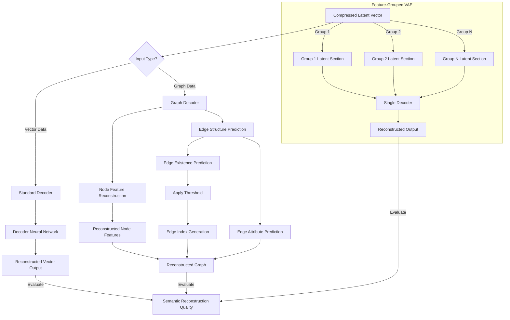

# Reconstruction Process in the Meaning-Preserving Transformation System

This document explains how the reconstruction process works in our Meaning-Preserving Transformation System.

## Overview

Reconstruction is a critical part of our transformation system, where compressed latent representations are decoded back into their original form while preserving semantic meaning. This process is the counterpart to the encoding phase and completes the transformation pipeline.

## Reconstruction Flow Diagram



## Reconstruction Flow

The reconstruction process follows these steps:

1. **Latent Space Representation**: Starting with a compressed latent vector from the bottleneck
2. **Decoding**: Transforming the latent representation back to the original format
3. **Output Validation**: Ensuring the reconstructed state maintains semantic integrity

## Implementation Details

### Vector-Based Reconstruction (Standard VAE)

For standard vector inputs, reconstruction is handled by the `Decoder` class:

```python
# Decode from compressed representation
reconstruction = self.decoder(z_compressed)
```

The `Decoder` implements a neural network with:
- Multiple hidden layers with configurable dimensions
- Optional batch normalization
- LeakyReLU activation functions
- Final linear layer that projects to the original input dimensions

### Graph-Based Reconstruction

For graph-structured data, reconstruction is more complex and is handled by the `GraphDecoder` class:

1. **Node Feature Reconstruction**:
   ```python
   # Reconstruct node features
   node_features = self.node_decoder(node_embeddings)
   ```

2. **Edge Structure Reconstruction**:
   ```python
   # Create all possible node pairs for edge prediction
   num_nodes = node_embeddings.size(0)
   node_i = node_embeddings.repeat_interleave(num_nodes, dim=0)
   node_j = node_embeddings.repeat(num_nodes, 1)
   ```

3. **Edge Existence and Attribute Prediction**:
   ```python
   # Predict edge existence and features
   edge_outputs = self.edge_predictor(edge_inputs)
   edge_logits = edge_outputs[:, 0].view(num_nodes, num_nodes)
   edge_features = edge_outputs[:, 1:].view(num_nodes, num_nodes, -1)
   ```

4. **Complete Graph Reconstruction**:
   ```python
   # Apply threshold to create edge index
   edge_probs = torch.sigmoid(edge_logits)
   edge_mask = edge_probs > threshold
   # Create edge index from mask
   edge_index = torch.nonzero(edge_mask).t().contiguous()
   ```

### Feature-Grouped Reconstruction

For models using feature groups with different compression levels (`FeatureGroupedVAE`):

1. Each feature group has its own section in the latent space
2. During decoding, the entire compressed latent vector is passed to the decoder:
   ```python
   return self.decoder(z)
   ```
3. The decoder reconstructs all feature groups simultaneously while preserving their relative importance

## Model Variations

### MeaningVAE

The standard implementation that handles both vector and graph inputs:
- Uses `self.decoder(z_compressed)` for reconstruction
- For graph data, uses `self.graph_decoder(z_compressed)`

### AdaptiveMeaningVAE

Uses a dynamic compression approach with an adaptive bottleneck:
- Decoder architecture matches standard models
- Compression level can be adjusted at runtime

### FeatureGroupedVAE

Applies different compression rates to different feature groups:
- Preserves the most important features with lower compression
- Reconstructs all features simultaneously through a single decoder

## Meaning Preservation

The key difference between this system and standard autoencoders is the focus on semantic meaning:

1. Loss functions include components specifically for meaning preservation
2. Reconstruction quality is measured not just by structural similarity but by semantic coherence
3. The latent space is organized to prioritize meaningfully related concepts

## Usage in the Pipeline

In the transformation pipeline, reconstruction is typically the final step:

```python
# DecoderComponent in pipeline.py
def process(self, data: torch.Tensor, context: Dict[str, Any] = None):
    reconstruction = self.decoder(data)
    context["reconstruction"] = reconstruction
    return reconstruction, context
```

---

This document provides an overview of how reconstruction works in our system. The process is designed to complement the encoding and compression phases, creating a complete pipeline that can transform agent states across different representational forms while preserving their semantic meaning. 
