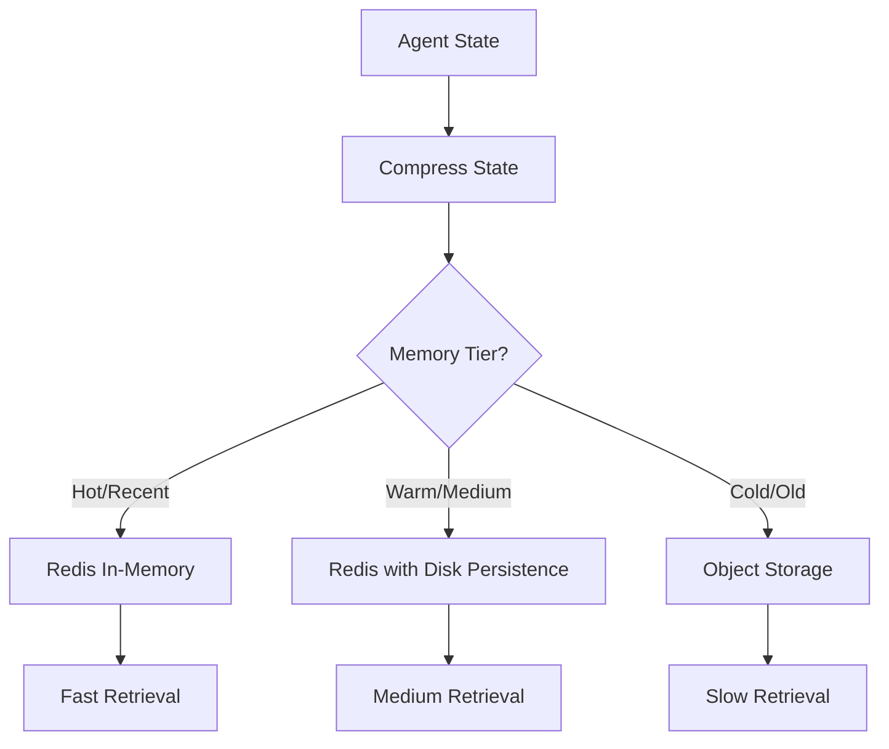

# Redis Implementation for Agent Memory System

This document outlines the recommended approach for implementing the agent memory system using Redis, a high-performance in-memory data store.

## Redis Data Structure Design

For optimal performance and flexibility, we recommend using the following Redis key structure:

```
# Key structure:
agent:{agent_id}:memory:{timestamp} → Binary compressed vector
agent:{agent_id}:memories → Sorted set with score=timestamp
agent:{agent_id}:metadata → Hash with model parameters, compression rates etc.
```

## Implementation Blueprint

```python
import redis
import torch
import io
import json
import time
from typing import Dict, List, Any, Optional

class RedisAgentMemory:
    def __init__(self, redis_url="redis://localhost:6379/0", compression_threshold=1000):
        self.redis = redis.from_url(redis_url)
        self.compression_threshold = compression_threshold
        
    def store_agent_memory(self, agent_id: str, agent_state: torch.Tensor, 
                          metadata: Optional[Dict[str, Any]] = None):
        """Store compressed agent memory in Redis"""
        # Get the agent's memory system or create if doesn't exist
        memory_system = self._get_memory_system(agent_id)
        
        # Encode/compress the state
        compressed_state = memory_system.encode(agent_state)
        
        # Generate timestamp (use millisecond precision)
        timestamp = int(time.time() * 1000)
        
        # Serialize the compressed tensor efficiently
        buffer = io.BytesIO()
        torch.save(compressed_state, buffer)
        compressed_bytes = buffer.getvalue()
        
        # Store main memory entry
        memory_key = f"agent:{agent_id}:memory:{timestamp}"
        self.redis.set(memory_key, compressed_bytes)
        
        # Update the sorted index of memories
        self.redis.zadd(f"agent:{agent_id}:memories", {str(timestamp): timestamp})
        
        # Optionally store metadata about this memory
        if metadata:
            metadata_key = f"agent:{agent_id}:memory:{timestamp}:meta"
            self.redis.hmset(metadata_key, metadata)
            
        # Memory management - trim if needed
        if self.redis.zcard(f"agent:{agent_id}:memories") > self.compression_threshold:
            self._apply_memory_management(agent_id)
        
        return timestamp
    
    def retrieve_agent_memory(self, agent_id: str, timestamp: int) -> Dict[str, Any]:
        """Retrieve and reconstruct a specific memory"""
        # Get agent's memory system
        memory_system = self._get_memory_system(agent_id)
        
        # Retrieve compressed state
        memory_key = f"agent:{agent_id}:memory:{timestamp}"
        compressed_bytes = self.redis.get(memory_key)
        
        if not compressed_bytes:
            raise KeyError(f"Memory not found for agent {agent_id} at timestamp {timestamp}")
        
        # Deserialize
        buffer = io.BytesIO(compressed_bytes)
        compressed_state = torch.load(buffer)
        
        # Reconstruct the state
        reconstructed_state = memory_system.decode(compressed_state)
        
        # Get metadata if available
        result = {"state": reconstructed_state, "timestamp": timestamp}
        
        metadata_key = f"agent:{agent_id}:memory:{timestamp}:meta"
        if self.redis.exists(metadata_key):
            result["metadata"] = self.redis.hgetall(metadata_key)
            
        return result
    
    def get_recent_memories(self, agent_id: str, count: int = 10) -> List[Dict[str, Any]]:
        """Get most recent memories for replay or training"""
        # Get recent timestamps from sorted set
        memory_keys = self.redis.zrevrange(f"agent:{agent_id}:memories", 0, count-1)
        
        # Retrieve each memory
        memories = []
        for timestamp_bytes in memory_keys:
            timestamp = int(timestamp_bytes)
            try:
                memory = self.retrieve_agent_memory(agent_id, timestamp)
                memories.append(memory)
            except Exception as e:
                print(f"Error retrieving memory {timestamp}: {e}")
                
        return memories
    
    def _get_memory_system(self, agent_id: str):
        """Get or create agent's memory system"""
        # Check if we have a memory system configuration stored
        system_key = f"agent:{agent_id}:memory_system"
        if not self.redis.exists(system_key):
            # Create new memory system for this agent
            memory_system = self._create_memory_system(agent_id)
            
            # Save configuration
            config = memory_system.get_config()
            self.redis.set(system_key, json.dumps(config))
            
            return memory_system
        else:
            # Load existing configuration
            config = json.loads(self.redis.get(system_key))
            return self._load_memory_system(config)
    
    def _create_memory_system(self, agent_id: str):
        """Create a new memory system for an agent"""
        # Example of creating a FeatureGroupedVAE for this agent
        from meaning_transform.src.models.feature_grouped_vae import FeatureGroupedVAE
        
        # Define feature groups based on agent type
        # (simplified example)
        feature_groups = {
            "critical": (0, 10, 0.3),   # (start, end, compression)
            "spatial": (10, 20, 0.5),
            "social": (20, 30, 0.4),
            "other": (30, 50, 0.8),
        }
        
        # Create the VAE
        memory_system = FeatureGroupedVAE(
            input_dim=50,  # Total agent state dimension
            latent_dim=25,  # Compressed dimension
            feature_groups=feature_groups,
            base_compression_level=0.5,
        )
        
        return memory_system
    
    def _load_memory_system(self, config: Dict[str, Any]):
        """Load a memory system from configuration"""
        from meaning_transform.src.models.feature_grouped_vae import FeatureGroupedVAE
        
        # Recreate the memory system from config
        memory_system = FeatureGroupedVAE(
            input_dim=config["input_dim"],
            latent_dim=config["latent_dim"],
            feature_groups=config["feature_groups"],
            base_compression_level=config["base_compression_level"],
        )
        
        return memory_system
    
    def _apply_memory_management(self, agent_id: str):
        """Apply memory management strategies"""
        # Strategy 1: Simple trimming of oldest memories
        memory_index = f"agent:{agent_id}:memories"
        oldest_count = 100  # Number of oldest memories to check
        
        # Get oldest memories
        oldest_timestamps = self.redis.zrange(memory_index, 0, oldest_count-1)
        
        # Remove some percentage of the oldest memories (e.g., 20%)
        to_remove = oldest_timestamps[:int(len(oldest_timestamps) * 0.2)]
        
        # Delete memories and their metadata
        pipeline = self.redis.pipeline()
        for timestamp_bytes in to_remove:
            timestamp = timestamp_bytes.decode('utf-8')
            pipeline.delete(f"agent:{agent_id}:memory:{timestamp}")
            pipeline.delete(f"agent:{agent_id}:memory:{timestamp}:meta")
            pipeline.zrem(memory_index, timestamp)
        
        pipeline.execute()
```

## Redis Optimization Techniques

### 1. Pipelining

Use Redis pipelines for bulk operations to reduce network roundtrips:

```python
pipe = redis.pipeline()
for i in range(100):
    pipe.set(f"key:{i}", f"value:{i}")
pipe.execute()
```

### 2. Memory Management Policies

Configure Redis with appropriate memory policies:

```
maxmemory 4gb
maxmemory-policy allkeys-lru
```

This configuration automatically evicts least recently used keys when memory is full.

### 3. Redis Streams for Sequential Data

For temporal data like agent experiences, consider using Redis Streams:

```python
# Add memory to a stream
redis.xadd(f"agent:{agent_id}:stream", {"compressed_state": compressed_bytes})

# Get recent memories
redis.xrevrange(f"agent:{agent_id}:stream", count=10)
```

### 4. Redis Modules

Consider specialized Redis modules for enhanced functionality:

- **RedisJSON**: For structured metadata storage
- **RediSearch**: For advanced queries on agent memories
- **RedisAI**: For tensor operations directly within Redis

## Scaling to Multiple Agents

### 1. Redis Cluster

For scaling to many agents, implement Redis Cluster:

```python
from rediscluster import RedisCluster

startup_nodes = [{"host": "127.0.0.1", "port": "7000"}]
redis_cluster = RedisCluster(startup_nodes=startup_nodes, decode_responses=True)
```

### 2. Sharding Strategy

Implement consistent hashing to distribute agent data:

```python
def get_redis_for_agent(agent_id):
    shard = hash(agent_id) % num_redis_shards
    return redis_connections[shard]
```

### 3. Memory Tiering Architecture



Implement a tiered storage system:
- **Hot Tier**: Recent memories in Redis (fast access, high cost)
- **Warm Tier**: Medium-term memories in Redis with disk persistence
- **Cold Tier**: Older memories in object storage like S3 (slower access, lower cost)

## Performance Considerations

1. **Serialization Format**: Consider using more efficient formats than pickle:
   - MessagePack
   - Protocol Buffers
   - FlatBuffers

2. **Compression**: Apply additional compression for large tensors:
   ```python
   import zlib
   compressed_data = zlib.compress(serialized_data)
   ```

3. **Batching**: Batch operations for memory retrieval:
   ```python
   pipe = redis.pipeline()
   for timestamp in timestamps:
       pipe.get(f"agent:{agent_id}:memory:{timestamp}")
   compressed_states = pipe.execute()
   ```

4. **Connection Pooling**: Use connection pools for multiple clients:
   ```python
   pool = redis.ConnectionPool(host='localhost', port=6379, db=0)
   redis_client = redis.Redis(connection_pool=pool)
   ```