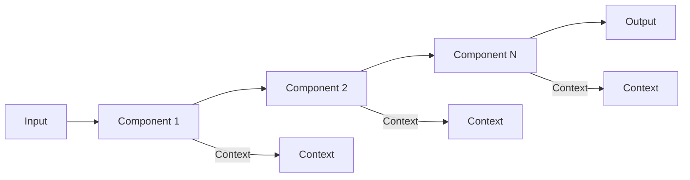
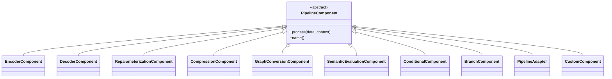
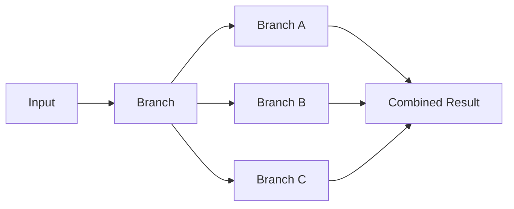
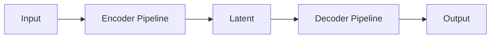
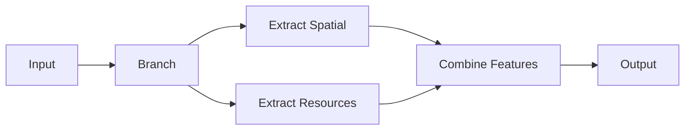
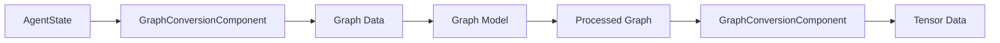
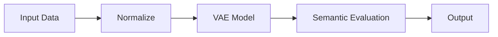
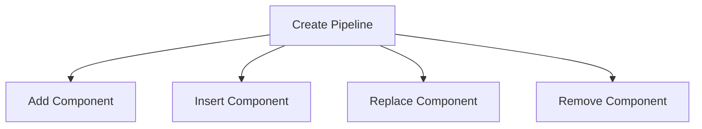

# Pipeline Architecture Documentation

## Overview

The pipeline architecture provides a flexible, modular system for building data transformation workflows. Each pipeline consists of components that process data sequentially, passing outputs from one component to the next along with a context dictionary for storing intermediate results and metrics.



## Creating a Basic Pipeline

```python
from meaning_transform.src.pipeline import Pipeline, PipelineComponent

# Create an empty pipeline
pipeline = Pipeline(name="MyPipeline")

# Add components
pipeline.add(component1)
pipeline.add(component2)

# Process data
result, context = pipeline.process(input_data)
```

## Component Types

The system includes several built-in component types:



## Creating Custom Components

Implement your own component by subclassing `PipelineComponent`:

```python
class MyComponent(PipelineComponent):
    def __init__(self, param1, param2):
        self.param1 = param1
        self.param2 = param2
        
    def process(self, data, context=None):
        if context is None:
            context = {}
            
        # Process data
        result = some_transformation(data)
        
        # Update context
        context['my_metric'] = calculate_metric(data, result)
        
        return result, context
```

For simpler cases, use the `CustomComponent` class:

```python
def my_transform_function(data, context=None):
    if context is None:
        context = {}
    
    # Process data
    result = some_transformation(data)
    context['my_metric'] = calculate_metric(data, result)
    
    return result, context

pipeline.add(CustomComponent(my_transform_function, name="MyTransform"))
```

## Branching and Conditional Processing

The pipeline architecture supports branching for parallel processing and conditional execution:



Example:

```python
from meaning_transform.src.pipeline import BranchComponent

# Create a branch component
pipeline.add(
    BranchComponent({
        'branch_a': component_a,
        'branch_b': component_b,
        'branch_c': component_c
    })
)
pipeline.add(CustomComponent(combine_results))
```

For conditional processing:

```python
from meaning_transform.src.pipeline import ConditionalComponent

# Only apply component if condition is met
pipeline.add(
    ConditionalComponent(
        predicate=lambda data, ctx: data.shape[1] > 10,
        component=component_to_apply_conditionally
    )
)
```

## Using Factory Methods

The `PipelineFactory` provides convenient methods for creating common pipeline configurations:

```python
from meaning_transform.src.pipeline import PipelineFactory
from meaning_transform.src.models import MeaningVAE

# Create a model
model = MeaningVAE(input_dim=64, latent_dim=16)

# Create a VAE pipeline
vae_pipeline = PipelineFactory.create_vae_pipeline(model)

# Create encoder-only pipeline
encoder_pipeline = PipelineFactory.create_encoder_only_pipeline(model)

# Create decoder-only pipeline
decoder_pipeline = PipelineFactory.create_decoder_only_pipeline(model)

# Create custom pipeline with specific components
custom_pipeline = PipelineFactory.create_custom_pipeline(
    components=[component1, component2, component3],
    name="MyCustomPipeline"
)
```

## Pipeline Composition

Pipelines can be composed by feeding the output of one pipeline into another:



Example:

```python
# Process through encoder
latent, encoder_context = encoder_pipeline.process(input_data)

# Process through decoder
reconstruction, decoder_context = decoder_pipeline.process(latent)
```

## Feature-Specific Processing

Split your data into feature-specific branches for specialized processing:



Example:

```python
def extract_spatial_features(data, context=None):
    if context is None:
        context = {}
    spatial = data[:, :3]  # First 3 dimensions
    return spatial, context

def extract_resource_features(data, context=None):
    if context is None:
        context = {}
    resources = data[:, 3:7]  # Dimensions 3-6
    return resources, context

def combine_features(data, context=None):
    if context is None:
        context = {}
    spatial = data['spatial']
    resources = data['resources']
    combined = torch.cat([spatial, resources], dim=1)
    return combined, context

# Create feature-specific pipeline
pipeline = Pipeline(name="FeatureSpecificPipeline")
pipeline.add(
    BranchComponent({
        'spatial': CustomComponent(extract_spatial_features),
        'resources': CustomComponent(extract_resource_features)
    })
)
pipeline.add(CustomComponent(combine_features))
```

## Semantic Evaluation

Evaluate the semantic preservation of your transformations:

```python
from meaning_transform.src.pipeline import SemanticEvaluationComponent
from meaning_transform.src.standardized_metrics import StandardizedMetrics

metrics = StandardizedMetrics()

def evaluate_semantics(original, reconstructed):
    return metrics.evaluate(original, reconstructed)

# Add evaluation component to pipeline
pipeline.add(PipelineAdapter(model))
pipeline.add(SemanticEvaluationComponent(evaluate_semantics))
```

The evaluation results are stored in the context dictionary:

```python
result, context = pipeline.process(input_data)
print(f"Semantic drift: {context['semantic_evaluation']['drift']['overall_drift']:.4f}")
```

## Working with Graph Data

The pipeline architecture supports processing graph-structured data:



```python
from meaning_transform.src.pipeline import GraphConversionComponent
from meaning_transform.src.knowledge_graph import AgentStateToGraph

# Create graph converter
graph_converter = AgentStateToGraph(
    relationship_threshold=0.5,
    include_relations=True,
    property_as_node=True
)

# Add graph conversion component
pipeline.add(GraphConversionComponent(graph_converter, direction="to_graph"))

# Process with graph-based model
pipeline.add(PipelineAdapter(graph_model))

# Convert back to tensor if needed
pipeline.add(GraphConversionComponent(graph_converter, direction="to_tensor"))
```

## Complete Example

Here's a complete example showing a custom pipeline with normalization, model processing, and semantic evaluation:



```python
import torch
from meaning_transform.src.pipeline import (
    Pipeline, 
    CustomComponent,
    PipelineAdapter,
    SemanticEvaluationComponent
)
from meaning_transform.src.model import MeaningVAE
from meaning_transform.src.standardized_metrics import StandardizedMetrics

# Create model
model = MeaningVAE(input_dim=64, latent_dim=16)

# Create metrics
metrics = StandardizedMetrics()

# Create normalization function
def normalize_data(data, context=None):
    if context is None:
        context = {}
    
    normalized = (data - data.mean()) / data.std()
    context['original_mean'] = data.mean().item()
    context['original_std'] = data.std().item()
    
    return normalized, context

# Create semantic evaluation function
def evaluate_semantics(original, reconstructed):
    return metrics.evaluate(original, reconstructed)

# Create pipeline
pipeline = Pipeline(name="CustomPipeline")
pipeline.add(CustomComponent(normalize_data, name="Normalize"))
pipeline.add(PipelineAdapter(model))
pipeline.add(SemanticEvaluationComponent(evaluate_semantics))

# Create sample data
input_data = torch.randn(32, 64)  # 32 samples, 64 features

# Process data
result, context = pipeline.process(input_data)

# Access results
print(f"Original mean: {context['original_mean']:.4f}")
print(f"Original std: {context['original_std']:.4f}")
print(f"Semantic drift: {context['semantic_evaluation']['drift']['overall_drift']:.4f}")
```

## Best Practices

1. **Single Responsibility**: Keep components focused on a single responsibility.
2. **Context Usage**: Use the context dictionary for metrics and intermediate results.
3. **Composition**: Compose pipelines for complex workflows rather than creating monolithic components.
4. **Parallel Processing**: Leverage branching for parallel processing paths.
5. **Specialization**: Implement custom components for specialized transformations.
6. **Reuse**: Use factory methods for common pipeline patterns.
7. **Evaluation**: Include semantic evaluation to measure meaning preservation.
8. **Error Handling**: Handle exceptions in component implementations to avoid breaking the pipeline.
9. **Documentation**: Document the purpose and output of each component.
10. **Testing**: Test components individually before integrating them into the pipeline.

## Pipeline Modification

Pipelines can be modified after creation:



```python
# Add a component
pipeline.add(new_component)

# Insert a component at a specific position
pipeline.insert(2, new_component)

# Replace a component
pipeline.replace(1, replacement_component)

# Remove a component
pipeline.remove(3)
```

## Debugging Pipelines

To debug a pipeline, examine the context dictionary after processing:

```python
result, context = pipeline.process(input_data)

# Print component-specific results
for i in range(len(pipeline.components)):
    print(f"Result after component {i}: {context[f'result_{i}']}")

# Print overall context
print(f"Context keys: {list(context.keys())}")
``` 