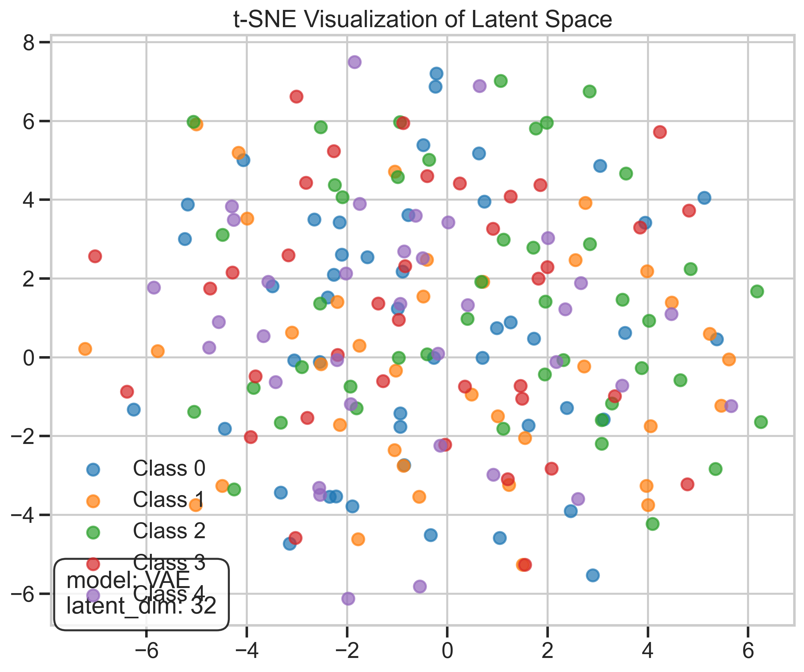
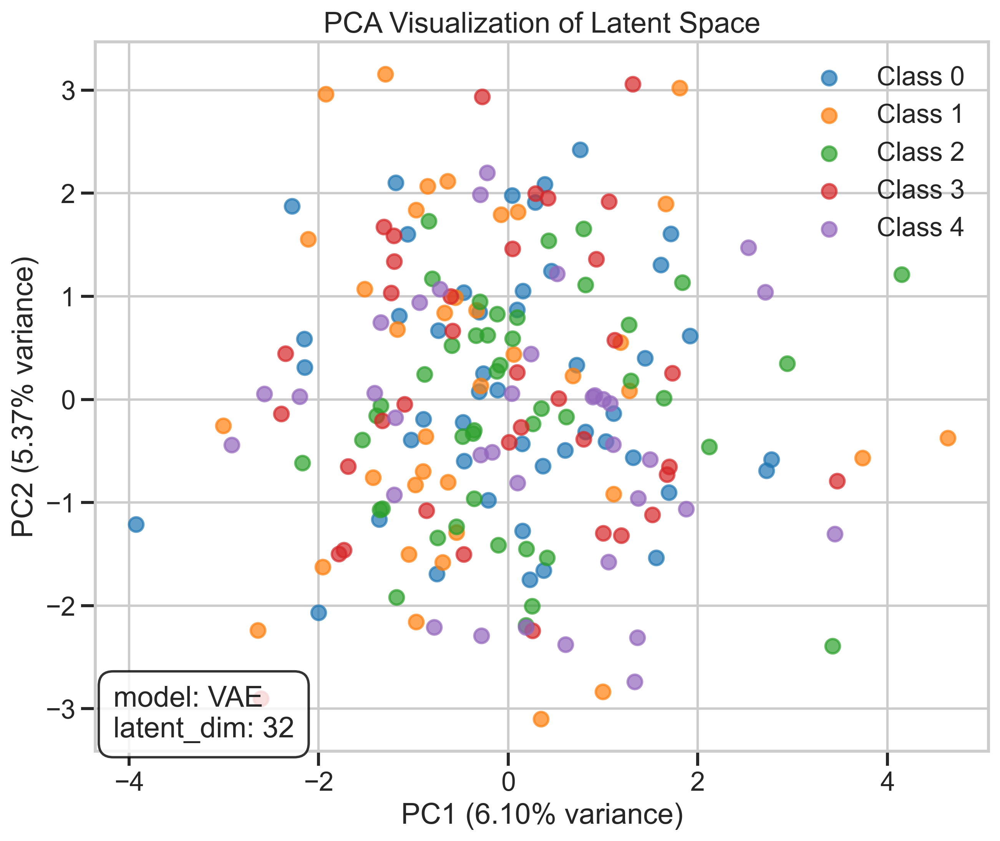
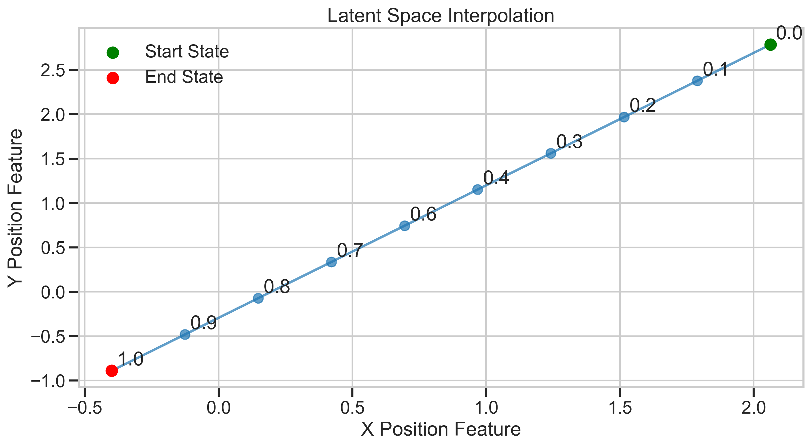
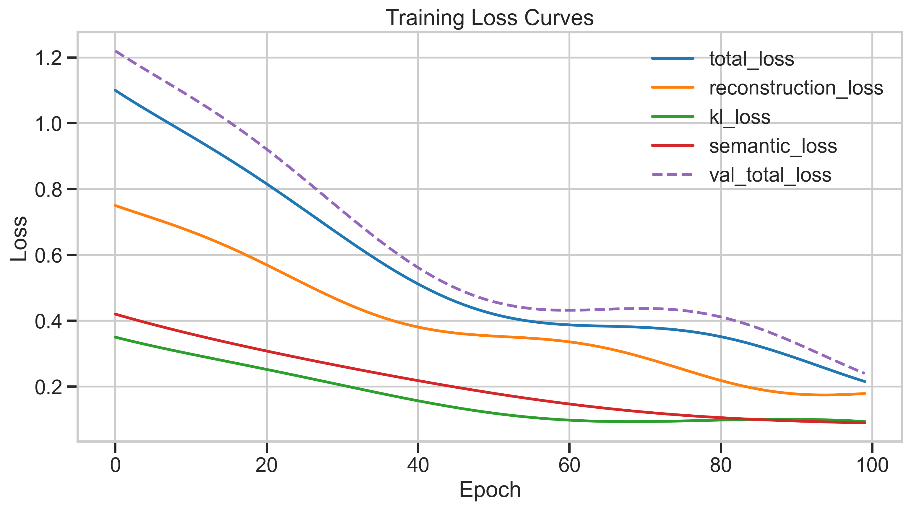
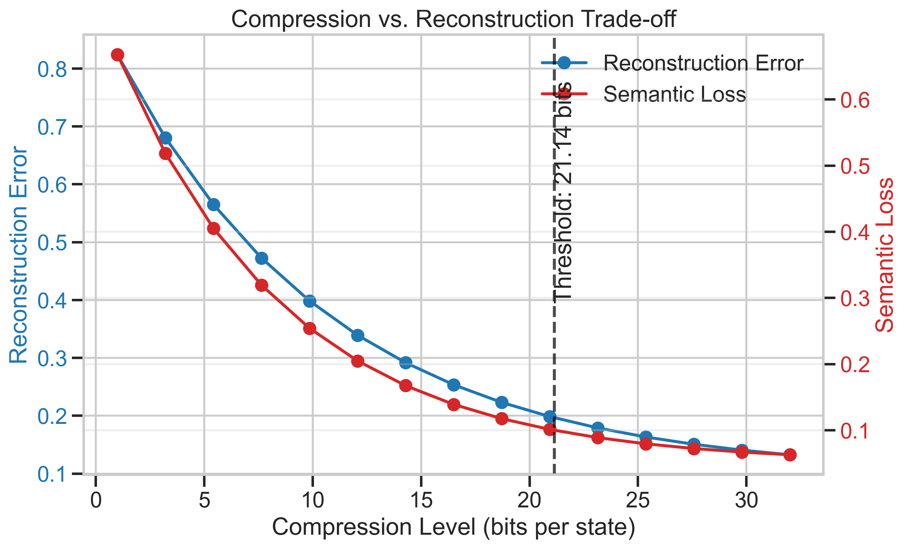
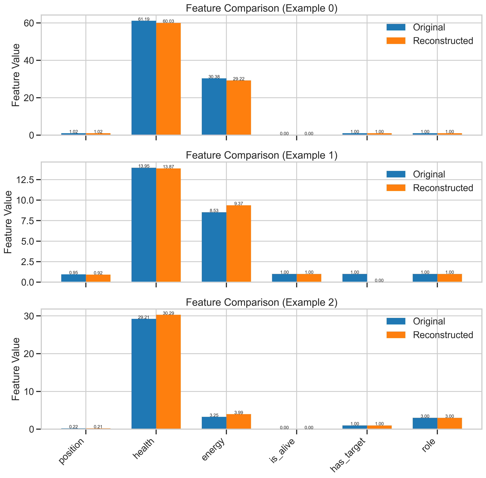
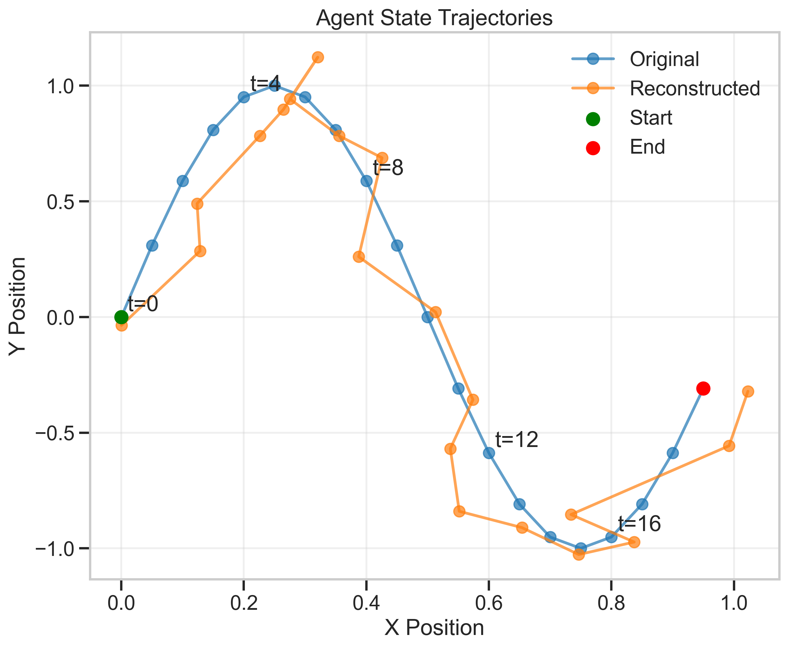
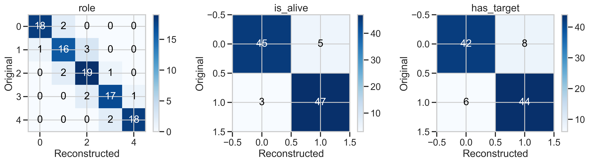
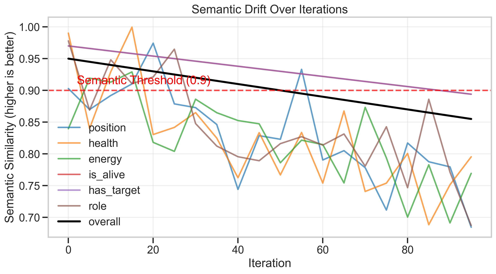
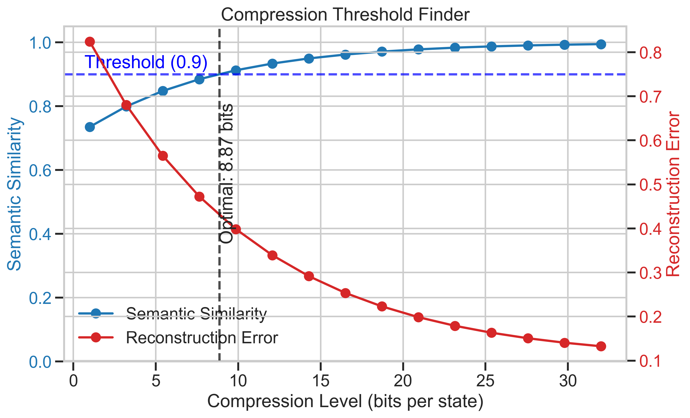

# Visualization Interpretation Guide

This guide explains how to interpret the visualization outputs from the meaning-preserving transformation system. Each visualization type reveals different aspects of how meaning is preserved (or lost) across transformations.

## 1. Latent Space Visualizations

### t-SNE Visualization

**How to interpret:**
- **Clusters**: States that appear close together in the t-SNE visualization have similar latent representations
- **Colors**: Different colors represent different classes/roles of agents
- **Outliers**: Points far from any cluster may be unusual states or errors in encoding
- **Transitions**: If you see smooth gradients between clusters, the model has learned a continuous latent space

**Signs of good meaning preservation:**
- States with similar semantic meaning cluster together
- Clear separation between functionally different agents
- States with the same role/class but different parameter values form coherent regions

**Warning signs:**
- Random scattering with no discernible pattern
- Similar semantic states appearing in distant regions
- Excessive overlapping between functionally different states

### PCA Visualization

**How to interpret:**
- **Axes**: The principal components represent the directions of greatest variance in your latent space
- **Variance percentages**: Higher percentages indicate more information is captured in that dimension
- **Patterns**: Linear or non-linear patterns indicate structure in the latent space

**Signs of good meaning preservation:**
- Clear separation of different agent types along principal components
- First few components capturing significant variance (>50% combined)
- Logical progression of states along principal component axes

**Warning signs:**
- Low variance explanation in first components (suggests high dimensionality is required)
- Random distribution with no clear patterns
- Key semantic features not aligning with principal components

## 2. Latent Interpolation

**How to interpret:**
- **Start/End points**: Green point is the starting state, red point is the ending state
- **Interpolation path**: Shows how decoded states change as you move through latent space
- **Alpha values**: Indicates the interpolation percentage (0.0 = start state, 1.0 = end state)

**Signs of good meaning preservation:**
- Smooth, continuous transitions between states
- Semantically meaningful intermediate states
- Physically plausible trajectories for position-based features

**Warning signs:**
- Discontinuous jumps between states
- Implausible or semantically invalid intermediate states
- Path that takes illogical detours instead of direct transitions

## 3. Loss Curves

**How to interpret:**
- **X-axis**: Training epochs
- **Y-axis**: Loss values (lower is better)
- **Multiple curves**: Different components of the loss function
- **Solid vs. dashed**: Training vs. validation losses

**Signs of good training:**
- Consistent downward trend in both training and validation losses
- Stable convergence without wild oscillations
- Semantic loss components decreasing alongside reconstruction loss

**Warning signs:**
- Validation loss increasing while training loss continues to decrease (overfitting)
- Plateauing too early (underfitting)
- Large spikes or instability in loss curves
- Semantic loss not improving while reconstruction loss decreases

## 4. Compression vs. Reconstruction Trade-off

**How to interpret:**
- **X-axis**: Compression level (bits per state)
- **Blue line (left Y-axis)**: Reconstruction error (lower is better)
- **Red line (right Y-axis)**: Semantic loss (lower is better)
- **Vertical dashed line**: Threshold where semantic loss crosses a critical value

**Signs of good compression:**
- Reconstruction error decreases smoothly as bits increase
- Semantic loss remains low even at moderate compression levels
- Clear "elbow point" where additional bits provide diminishing returns

**Warning signs:**
- Semantic loss increasing sharply at moderate compression levels
- No clear relationship between bits and reconstruction quality
- No convergence of reconstruction error even at high bit rates

## 5. Feature Comparison Visualization

**How to interpret:**
- **X-axis**: Different features of the agent state
- **Blue bars**: Original feature values
- **Orange bars**: Reconstructed feature values
- **Multiple plots**: Different examples from the dataset

**Signs of good reconstruction:**
- Reconstructed values closely match original values across all features
- Critical features (like "is_alive") match exactly
- Consistent reconstruction quality across multiple examples

**Warning signs:**
- Large discrepancies in important features
- Systematic bias in reconstructed values (always higher/lower)
- Some features reconstructed well while others poorly

## 6. State Trajectories

**How to interpret:**
- **Blue line**: Original agent trajectory
- **Orange line**: Reconstructed agent trajectory
- **Green point**: Starting position
- **Red point**: Ending position
- **Time labels**: Indicate progression through the trajectory

**Signs of good reconstruction:**
- Reconstructed trajectory closely follows original path
- Critical points (start, end, key turns) match well
- Similar velocity and acceleration patterns

**Warning signs:**
- Reconstructed path diverging significantly from original
- "Cutting corners" or simplifying complex movements
- Delayed or anticipated movements (timing differences)
- Jittery or unrealistic movement in reconstructed path

## 7. Confusion Matrices

**How to interpret:**
- **Rows**: Original class/state
- **Columns**: Reconstructed class/state
- **Diagonal values**: Correct reconstructions
- **Off-diagonal values**: Errors in reconstruction

**Signs of good reconstruction:**
- High values along the diagonal (accurate classifications)
- Low values in off-diagonal cells (few misclassifications)
- Even distribution of errors (no systematic bias)

**Warning signs:**
- Low diagonal values for certain classes
- Systematic misclassification patterns (always confusing class A with B)
- Highly asymmetric confusion matrix

## 8. Semantic Drift Visualization

**How to interpret:**
- **X-axis**: Iterations or compression levels
- **Y-axis**: Semantic similarity (higher is better)
- **Multiple lines**: Different semantic features
- **Black line**: Overall semantic similarity
- **Horizontal red line**: Semantic similarity threshold

**Signs of good meaning preservation:**
- High semantic similarity maintained across iterations/compression levels
- Critical features remaining above threshold longer
- Overall score staying high even as individual features fluctuate

**Warning signs:**
- Rapid decline in semantic similarity scores
- Critical features dropping below threshold early
- Large variability in feature scores (unstable preservation)
- Divergent trends among different features

## 9. Compression Threshold Finder

**How to interpret:**
- **X-axis**: Compression level (bits per state)
- **Blue line (left Y-axis)**: Semantic similarity (higher is better)
- **Red line (right Y-axis)**: Reconstruction error (lower is better)
- **Horizontal blue line**: Semantic similarity threshold
- **Vertical black line**: Optimal compression level

**Signs of good threshold finding:**
- Clear intersection of semantic similarity with threshold line
- Significant reduction in reconstruction error before reaching threshold
- Stable semantic similarity over a range of compression levels

**Warning signs:**
- Semantic similarity dropping below threshold at very high bit rates
- No clear intersection with threshold line
- Unstable semantic similarity across compression levels
- Reconstruction error remaining high even at low compression rates

## General Interpretation Principles

1. **Context matters**: Always interpret visualizations in the context of your specific agent states and semantic properties

2. **Compare across hyperparameters**: Use these visualizations to compare different model architectures, latent dimensions, or loss functions

3. **Track over time**: Monitor these visualizations throughout training to catch meaning degradation early

4. **Feature importance**: Pay special attention to critical semantic features that define agent behavior

5. **Outliers vs. trends**: Focus on systematic patterns rather than individual outliers, which may be noise

6. **Multiple scales**: Examine both detailed feature-level metrics and high-level aggregate measures

By using these visualization tools together, you can gain comprehensive insight into how well your model preserves meaning across transformations, where it fails, and how to improve it. 